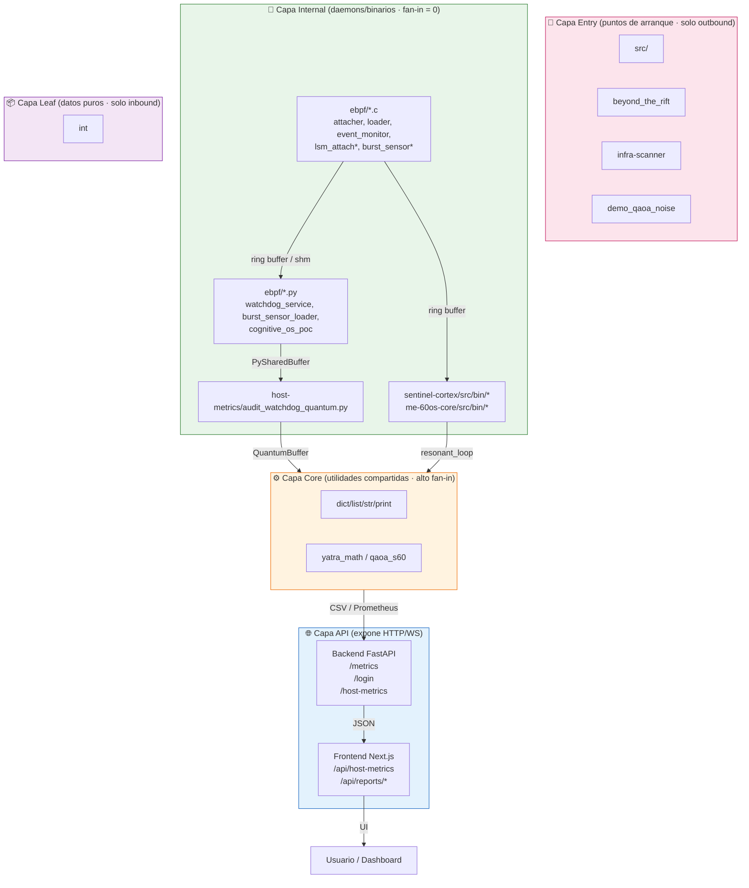
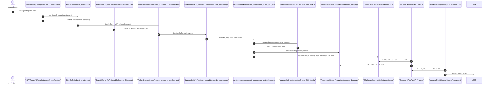

# Arquitectura del Proyecto **sentinel** — Informe Completo

> Generado automáticamente con herramientas **codebase-memory-mcp** sobre el repositorio indexado (`/home/jnovoas/Proyectos/sentinel`).

---

## 1. Métricas Generales

| Métrica | Valor |
|---------|-------|
| **Nodos totales** | 23 948 |
| **Aristas totales** | 43 703 |
| **Archivos analizados** | 1 337 |
| **Lenguajes principales** | Python (255), Rust (85), Bash (71), TypeScript (39), C (20), YAML (34) |
| **Paquetes externos detectados** | 30 (FastAPI, Celery, PyJWT, asyncpg, bcrypt, httpx, google-genai, numpy, nvidia-ml-py3, etc.) |
| **Puntos de entrada (entry-points)** | 20+ (eBPF C, daemons Python/Rust, APIs Next.js/FastAPI, binarios Rust, workflows n8n) |
| **Rutas HTTP detectadas** | 88 (mix FastAPI + Next.js API routes) |

---

## 2. Clusters Funcionales (Comunidades Leiden)

| ID | Etiqueta | Nodos | Cohesión | Top-nodes representativos | Paquetes | Aristas predominantes |
|----|----------|-------|----------|---------------------------|----------|----------------------|
| 3,4,0,58,2,72 | **quantum** | ~850 | 0.47 – 0.73 | `solve_maxcut`, `run_penta_resonance_experiment`, `S60`, `QuantumLatticeEngine` | `quantum`, `backend`, `internal` | `CALLS` |
| 18,17 | **me-60os-core** | ~300 | 0.61 – 0.80 | `SPA.to_raw`, `SPA.from_raw`, `zero`, `collect` | `sentinel-cortex`, `quantum`, `services`, `truthsync-core` | `CALLS` |
| 19 | **sentinel-cortex** | 144 | **0.82** | `resonant_loop`, `ebpf_cortex_bridge`, `buffer_system` | `sentinel-cortex`, `quantum`, `internal` | `CALLS` |
| 7 | **host-metrics** | 124 | 0.58 | `get`, `error`, `close`, `run_levitation_test`, `check_redis` | `host-metrics`, `me-60os-core`, `quantum`, `ebpf` | `CALLS` |
| 6 | **backend** | 97 | 0.57 | `str`, `execute`, `record`, `step`, `QuantumLatticeEngine` | `backend`, `quantum`, `sentinel-cortex`, `tests` | `CALLS` |
| 333 | **scripts** | 42 | **0.98** | `main`, `log_debug`, `log_info`, `log_error`, `validate_backup` | `scripts` | `CALLS` |

---

## 3. Capas Arquitectónicas (Layers)



---

## 4. Flujo de Datos Completo (End-to-End)

### 4.1 Diagrama de Secuencia Principal



### 4.2 Flujo Alternativo: Rust Consumer (sentinel-cortex)

```mermaid
flowchart LR
    Kernel[(Kernel)] -->|tracepoint| EBPF_C[ebpf/attacher.c\nloader.c]
    EBPF_C -->|ring buffer\nburst_events| RB[(Ring Buffer)]
    RB -->|ring_buffer__poll| CORTEX_R[sentinel-cortex/src/main.rs]
    CORTEX_R -->|EbpfCortexBridge::handle_event| BRIDGE[ebpf_cortex_bridge.rs]
    BRIDGE -->|resonant_loop| RESONANT[engine/resonant_loop.rs]
    RESONANT -->|patterns| PATTERNS[engine/patterns.rs]
    RESONANT -->|math| MATH[math/s60.rs\nmath/harmonic_logic.rs]
    MATH -->|S60 arithmetic| SPA[me-60os-core/src/spa.rs]
    SPA -->|to_raw/from_raw| SHARED[PySharedBuffer]
    SHARED -->|Python side| PY_QB[QuantumBuffer.push]
    PY_QB -->|CSV/Prom| EXPORT[(metrics.csv\nPrometheus)]
    EXPORT --> API[Backend API]
    API --> UI[Frontend]
```



---

## 5. Componentes Clave y su Rol

| Componente | Lenguaje | Ubicación | Responsabilidad |
|------------|----------|-----------|-----------------|
| **eBPF attacher/loader** | C | `ebpf/attacher.c`, `ebpf/loader.c` | Cargar objeto BPF en kernel, encontrar mapa `burst_events`, configurar ring buffer. |
| **event_monitor** | C | `ebpf/event_monitor.c` | Poll ring buffer, callback `handle_event()` → imprime JSON a stdout. |
| **PySharedBuffer** | Rust + Python | `me-60os-core/src/shm_bridge.rs` | Puente memoria compartida zero-copy entre eBPF y Python. |
| **QuantumBuffer** | Python | `host-metrics/audit_watchdog_quantum.py` | Cola circular thread-safe para eventos; expone `push`, `stats`, `size`. |
| **QuantumSchedulerDaemon** | Python | `host-metrics/audit_watchdog_quantum.py` | Programador basado en φ (golden ratio) para muestreo adaptativo. |
| **resonant_loop** | Rust | `sentinel-cortex/src/engine/resonant_loop.rs` | Motor de resonancia: filtra, detecta picos, genera ciclos. |
| **ebpf_cortex_bridge** | Rust | `sentinel-cortex/src/ebpf_cortex_bridge.rs` | Traduce eventos eBPF → estructuras internas de Cortex. |
| **QuantumLatticeEngine** | Python | `quantum/quantum_lattice_engine.py` | Simulador de red cuántica (Max-Cut, VQE, resonancia penta). |
| **S60 / Yatra Math** | Rust + Python | `sentinel-cortex/src/math/s60.rs`, `quantum/yatra_backup/` | Aritmética base-60 (sexagesimal) para precisión cuántica. |
| **PrometheusRegistry** | Python | `quantum/telemetry_bridge.py` | Exporta métricas a Prometheus (`set`, `inc`, `observe`). |
| **FastAPI Backend** | Python | `backend/app/` | REST API: `/health`, `/metrics`, `/login`, `/host-metrics`, WebSockets. |
| **Next.js Frontend** | TypeScript | `frontend/src/app/` | Pages: `/analytics`, `/ai/playground`; API routes: `/api/host-metrics`, `/api/reports/*`. |
| **n8n Workflows** | JSON | `n8n/workflows/`, `docker/n8n/workflows/` | Orquestación: alertas, reportes diarios, backup, health-checks. |

---

## 6. Hotspots (Mayor Fan-in = Código Central)

| Función / Símbolo | Fan-in | Cluster | Descripción |
|-------------------|--------|---------|-------------|
| `SPA.to_raw` | 70 | me-60os-core | Serializa estado S60 a bytes raw. |
| `SPA.from_raw` | 52 | me-60os-core | Deserializa bytes raw a estado S60. |
| `SPA.new` | 61 | me-60os-core | Constructor de SPA (State-Preserving Automaton). |
| `PrometheusRegistry.set` | 63 | quantum/telemetry_bridge | Punto único de escritura de métricas Prometheus. |
| `S60._from_raw` | 42 | quantum/yatra_backup | Construcción S60 desde representación raw. |
| `S60.to_base_units` | 39 | quantum/yatra_backup | Conversión a unidades base (segundos, bytes, etc.). |

---

## 7. Dependencias Externas Críticas

| Ecosistema | Paquetes |
|------------|----------|
| **Python** | FastAPI, Celery, asyncpg, PyJWT, bcrypt, httpx, google-genai, numpy, nvidia-ml-py3, GPUtil, passlib, email-validator |
| **Rust** | Crates internos: `me-60os-core`, `sentinel-cortex`, `truthsync-core`, `neural-guard` + dependencias estándar (tokio, serde, libbpf-rs, etc.) |
| **Sistema** | libbpf, clang/llvm (compilación eBPF), kernel headers, Redis, Prometheus, n8n, Docker |

---

## 8. Cómo Explorar Tú Mismo (Cheatsheet MCP)

```bash
# 1. Visión completa
mcp__codebase-memory-mcp__get_architecture --project sentinel --aspects '["all"]'

# 2. Buscar por semántica
mcp__codebase-memory-mcp__search_graph --project sentinel --query "host metrics collector eBPF"

# 3. Trazar llamadas desde entry-point
mcp__codebase-memory-mcp__trace_path --project sentinel \
  --function_name "sentinel.ebpf.attacher.main" \
  --mode calls --direction outbound --depth 4 --risk_labels true

# 4. Ver código exacto
mcp__codebase-memory-mcp__get_code_snippet --project sentinel \
  --qualified_name "sentinel.frontend.src.app.api.host-metrics.route.GET"

# 5. Consultas Cypher avanzadas
mcp__codebase-memory-mcp__query_graph --project sentinel \
  --query "MATCH (f:Function) WHERE f.complexity > 15 RETURN f.qualified_name, f.complexity ORDER BY f.complexity DESC LIMIT 20"
```

---

## 9. Próximos Pasos Sugeridos

1. **Documentar ADR** (Architecture Decision Records) con `manage_adr(mode="update")` para decisions clave: uso de base-60, arquitectura eBPF→user-space, elección de resonancia φ.
2. **Generar diagramas automáticos** exportando subgrafos a GraphViz/Mermaid desde consultas `query_graph`.
3. **Auditar complejidad** — buscar funciones con `transitive_loop_depth ≥ 3` o `linear_scan_in_loop > 0` para optimizar hot paths.
4. **Cross-repo intelligence** — si hay otros proyectos (ej. `sentinel_cubepath`, `sentinel_media`), indexarlos en modo `cross-repo-intelligence` para ver llamadas HTTP/async entre ellos.

---

> **Nota**: Este informe se generó a partir del grafo de conocimiento indexado (23 948 nodos, 43 703 aristas). Los diagramas Mermaid pueden renderizarse en cualquier visor compatible (GitHub, VS Code, Obsidian, Notion, etc.).

---

# Anexo A — Vista CubePath (sentinel_cubepath/README.md)

_Fusionado desde sentinel_cubepath/README.md (262 líneas)._

# 🛡️ Sentinel Ring-0 — AI Safety at Kernel Level

<p align="center">

## El Primer Firewall Cognitivo para Agentes de IA

*Opera en Ring-0 del Kernel Linux vía eBPF — intercepta intenciones antes de que se ejecuten.*

[Documentación Técnica](docs/TECHNICAL_DOCUMENTATION.md) · [Innovaciones Científicas](docs/SCIENTIFIC_INNOVATIONS.md)

</p>

---

## 🎯 ¿Qué es Sentinel Ring-0?

**Sentinel Ring-0** es un firewall cognitivo que opera a nivel de kernel (Ring 0) para proteger sistemas contra acciones no autorizadas de agentes de IA autónomos.

### El Problema

Los agentes de IA modernos pueden ejecutar comandos destructivos sin supervisión humana:

- `rm -rf /` → Borra todo el sistema
- `DROP DATABASE production;` → Elimina datos críticos
- Exfiltración de datos a servidores externos

**Ningún firewall tradicional intercepta intenciones — solo reglas de IP y puerto.**

### La Solución

Sentinel intercepta **todas** las llamadas al sistema antes de ejecutarse y aplica **lógica semántica** para determinar si la acción es segura:

```
┌─────────────────────────────────────────────────────────┐
│                    SENTINEL RING-0                       │
├─────────────────────────────────────────────────────────┤
│  AI Agent intenta: "rm -rf /"                            │
│                     ↓                                    │
│  ┌─────────────────────────────────────────────────┐    │
│  │  LSM Hook (bprm_check_security)                 │    │
│  │  Análisis Semántico en Kernel                   │    │
│  │  - ¿Es un comando destructivo? → SÍ             │    │
│  │  - ¿Está en whitelist? → NO                     │    │
│  │  - ¿Hay operador humano presente? → NO          │    │
│  └─────────────────────────────────────────────────┘    │
│                     ↓                                    │
│  ❌ BLOCKED: -EACCES (Permission Denied)                │
│                     ↓                                    │
│  📡 Evento enviado a Dashboard en tiempo real           │
└─────────────────────────────────────────────────────────┘
```

---

## ✨ Características Principales

| Característica | Descripción |
| --- | --- |
| **🧠 Lógica Semántica** | No solo whitelist: entiende INTENCIÓN. Permite `rm archivo.txt` pero bloquea `rm -rf /` |
| **⚡ Latencia Cero** | Opera en XDP/LSM (kernel level) — microsegundos, no milisegundos |
| **💓 Dead-Man Switch** | Si no detecta operador humano en 30s, activa cuarentena total de red |
| **🔢 Matemática Base-60** | Sin floats, sin errores de redondeo, precisión determinista |
| **📊 Dashboard en Tiempo Real** | WebSocket streaming de eventos del kernel con estilo Cyber-Dark |
| **🔐 Truth Claim API** | Verifica intenciones de IA antes de permitir acciones |

---

## 🏗️ Arquitectura

```
┌─────────────────────────────────────────────────────────────────┐
│                    SENTINEL CORTEX                               │
├─────────────────────────────────────────────────────────────────┤
│  RING 0 (Kernel — eBPF/C)                                       │
│  ├── lsm_ai_guardian.c     → Hook execve/file_open + RingBuffer │
│  ├── xdp_firewall.c        → Filtrado de red (latencia < 0.1ms) │
│  ├── tc_firewall.c         → Cuarentena total (kill-switch)     │
│  ├── burst_sensor.c        → Detección de DDoS                  │
│  └── guardian_cognitive.c   → Análisis semántico en kernel       │
├─────────────────────────────────────────────────────────────────┤
│  RING 3 (Userspace — Rust + Axum + Tokio)                       │
│  ├── ebpf.rs               → Bridge libbpf-rs (lectura zero-copy)│
│  ├── math.rs               → Motor aritmético S60 (Base-60)     │
│  ├── quantum.rs            → Bio-Resonador + Detector de fase   │
│  ├── harmonic.rs           → Lógica Armónica (6 estados)        │
│  ├── scheduler.rs          → Planificador Adaptativo V2 (94.4%) │
│  └── memory.rs             → Memoria vectorial con embeddings   │
├─────────────────────────────────────────────────────────────────┤
│  UI (React + TypeScript)                                         │
│  └── Dashboard, Telemetría Ring-0, Consola Truth Claim           │
└─────────────────────────────────────────────────────────────────┘
```

---

## 🛠️ Stack Tecnológico

| Capa | Tecnología |
| --- | --- |
| **Kernel** | eBPF (LSM, XDP, TC), libbpf, clang |
| **Backend** | Rust 1.75+, Axum, Tokio, libbpf-rs |
| **UI** | React, TypeScript |
| **Infra** | CubePath, Docker, Rocky Linux 10 |
| **Matemática** | S60 (Base-60 Fixed-Point) — Sin floats |

---

## 🔬 Innovaciones Científicas

### 1. Aritmética Sexagesimal (S60)

Motor matemático en Base-60 que elimina errores de IEEE 754. Usa exclusivamente enteros de 64 bits con escala de 60⁴ = 12,960,000. Más preciso que float32 para cálculos de fase.

### 2. Lógica Armónica

En lugar de `true/false` binario, usa **6 estados lógicos** basados en intervalos musicales (Unísono, Quinta, Cuarta, Tritono). Tolerancia de 9 segundos de arco (0.00025%).

### 3. Dead-Man Switch Biométrico

Detector de presencia humana que activa **cuarentena total a nivel de kernel** si no detecta operador por 30 segundos. Los programas eBPF persisten incluso si el proceso Rust muere.

### 4. Planificación Adaptativa

Basado en 35 experimentos empíricos. Ajusta dinámicamente el throughput de eventos según la carga: **94.4% de eficiencia, 63% de ahorro de CPU** vs planificador lineal.

> 📖 Documentación completa: [`docs/SCIENTIFIC_INNOVATIONS.md`](docs/SCIENTIFIC_INNOVATIONS.md)

---

## 📦 Instalación y Despliegue

### Requisitos

- Rust 1.75+
- Node.js 18+
- Docker (para CubePath)
- Linux Kernel 5.15+ (con soporte LSM/BPF)

### Desarrollo Local

```bash
# Clonar el repositorio
git clone https://github.com/jnovoas/sentinel-cubepath.git
cd sentinel-cubepath

# Backend
cd backend
cargo run

# Frontend (en otra terminal)
cd frontend
npm install
npm run dev
```

### Compilar Guardianes eBPF (requiere root)

```bash
cd backend/ebpf
make all        # Compila los 5 guardianes
sudo make load  # Carga en el kernel
make status     # Verifica estado
```

---

## 🚀 Uso de CubePath

Este proyecto utiliza **[CubePath](https://midu.link/cubepath)** como plataforma de despliegue:

1. **Despliegue simplificado**: Docker multi-stage sobre Rocky Linux
2. **SSL automático**: HTTPS sin configuración manual
3. **Soberanía del nodo**: Control total sobre el servidor para operaciones Ring-0
4. **Costo eficiente**: $15 gratis cubren la infraestructura necesaria

### Configuración CubePath

```yaml
# cubepath.yaml
name: sentinel-ring0
services:
  - name: api
    port: 8000
    env:
      RUST_LOG: info
  - name: dashboard
    port: 3000
```

---

## 📊 API Endpoints

| Endpoint | Método | Descripción |
| --- | --- | --- |
| `/health` | GET | Health check del sistema |
| `/api/v1/sentinel_status` | GET | Estado completo (ring, bio, XDP, LSM) |
| `/api/v1/truth_claim` | POST | Verificar intención de agente IA |
| `/api/v1/telemetry` | WS | Stream de eventos Ring-0 en tiempo real |

### Ejemplo: Verificar Claim de IA

```bash
curl -X POST http://localhost:8000/api/v1/truth_claim \
  -H "Content-Type: application/json" \
  -d '{
    "engine": "gpt-4",
    "claim_payload": "rm -rf /etc/passwd",
    "trust_threshold": 0.8
  }'

# Respuesta:
{
  "claim_valid": false,
  "sentinel_score": 0.05,
  "ring0_intercepts": 1,
  "harmonic_state": "DISSONANT_CRITICAL"
}
```

---

## 📈 Métricas de Rendimiento

| Métrica | Valor |
| --- | --- |
| Eficiencia del Planificador | **94.4%** |
| Ahorro de CPU vs lineal | **62.9%** |
| Tamaño de evento kernel | **32 bytes** (cache-line friendly) |
| Latencia XDP | **< 0.1ms** |
| Precisión S60 | **±0.0077 ppm** |

---

## 📝 Documentación Completa

- 📘 [Documentación Técnica](docs/TECHNICAL_DOCUMENTATION.md) — 10 módulos explicados bloque por bloque
- 🔬 [Innovaciones Científicas](docs/SCIENTIFIC_INNOVATIONS.md) — Las 4 contribuciones de frontera
- 📋 [Plan Maestro S60](docs/MASTER_S60_PLAN.md) — Fases de despliegue
- 🧪 [Módulos Cuánticos](docs/QUANTUM_MODULES.md) — Física de los módulos

---

## 👥 Equipo

Desarrollado por **Jaime Novoa** para la **Hackatón CubePath 2026**.

---

## 📄 Licencia

MIT License — Ver [LICENSE](LICENSE) para más detalles.

---

<div align="center">

**Hecho con ❤️ para la Hackatón CubePath 2026**

*"AI Safety at Kernel Level — Porque el futuro de Linux necesita un sistema inmunológico."*

</div>


---

# Anexo B — Inventario eBPF Ring 0 (sentinel_cubepath/docs/INVENTARIO_EBPF_C.md)

_Fusionado desde sentinel_cubepath/docs/INVENTARIO_EBPF_C.md (92 líneas)._

# 🛡️ Inventario de Ring 0: Módulos C eBPF (Realidad Hackatón)

Este inventario detalla los programas eBPF cargados en el nivel más profundo del Kernel de Linux para la protección de la infraestructura en CubePath.

---

## 🚀 1. Guardianes de Seguridad Cognitiva (LSM)

### `guardian_alpha_lsm.c`

* **Hook**: `lsm/bprm_check_security`
* **Función**: Implementa la política **FAIL-CLOSED**. Bloquea cualquier ejecución (`execve`) cuyo binario no esté validado en la `ai_whitelist`.
* **Dato Clave**: Es la primera línea de defensa contra agentes de IA autónomos.

### `lsm_ai_guardian.c` (v2.0)

* **Hook**: `lsm/file_open`
* **Lógica S60**: Implementa `calculate_s60_entropy` en kernel. Calcula segundos, minutos y grados de la señal de entropía usando el timestamp de nanosegundos del sistema.
* **Bridge**: Envía mini-eventos de 32 bytes sincronizados al bridge de Rust.

### `guardian_cognitive.c`

* **Función**: **Análisis Semántico de Intencionalidad**.
* **Lógica**: Escanea los argumentos y el nombre del archivo buscando keywords destructivas: `"attack"`, `"destroy"`, `"malicious"`.
* **Impacto**: Bloquea incluso scripts whitelisteados si su intención semántica es dañina.

---

## 📡 2. Sensores de Red y Cuarentena (XDP/TC)

### `burst_sensor.c`

* **Hook**: `xdp` (Network Driver Layer)
* **Función**: Monitor de alta velocidad. Calcula PPS (Paquetes por Segundo).
* **Umbrales**:
  * **LOW**: 1K pps
  * **HIGH**: 50K pps
  * **CRITICAL**: 100K pps (Dispara alerta inmediata al Cortex)

### `tc_firewall.c`

* **Hook**: `tc` (Traffic Control)
* **Función**: **Arco de Reflejo de Cuarentena**.
* **Panic Mode**: Si el CPU/Cortex detecta una anomalía crítica, cambia el `config_map` a modo "Quarantine (1)", lo que hace que este programa descarte TODO el tráfico entrante (`TC_ACT_SHOT`) instantáneamente.

---

## Contracto de Datos (`cortex_events.h`)

* **Estructura**: `cortex_event` (32 bytes, packed).
* **Campos**: `timestamp_ns`, `event_type`, `pid`, `entropy_signal`, `severity`.
* **Canal**: `BPF_MAP_TYPE_RINGBUF` (256KB por CPU).

---

## 📡 3. TC Firewall & Burst Sensor (Network Layer)

Protección de red a nivel de driver y tráfico.

* **XDP Burst Sensor**:
  * **Archivo**: `sentinel/ebpf/burst_sensor.c`
  * **Métrica**: PPS (Packets Per Second) per-CPU.
  * **Umbrales**: CRITICAL @ 100K pps.
* **TC Firewall**:
  * **Archivo**: `sentinel/ebpf/tc_firewall.c`
  * **Modo Pánico**: Capacidad de entrar en **"Quarantine Mode"** (System Sealed), bloqueando todo el tráfico IP instantáneamente desde el kernel.

---

## 📜 4. El Contrato de Verdad: `cortex_events.h`

El lenguaje común entre el Kernel y Rust.

* **Estructura Maestro**: `cortex_event` (32 bytes exactos, packed).
* **Axiomas de Tiempo**:
  * `BIO_PULSE_NS`: 17 segundos.
  * `QHC_CYCLE_NS`: 68 segundos (`17 * 4`).
  * `Salto-17`: Distribución de fase `Phase(n) = (n * 17) % 60`.
* **Tipos de Evento**:
    1. `EVENT_FILE_BLOCKED`
    2. `EVENT_EXEC_BLOCKED`
    3. `EVENT_NETWORK_BURST`
    4. `EVENT_QHC_RESET`

---

## 🛠️ 5. Módulos de Soporte (Backstage)

* **`loader.c` / `attacher.c`**: Mecanismo de orquestación para cargar los programas `.o` en el kernel.
* **`benchmark_exec.c`**: Medición de latencia de intercepción (microsegundos).
* **`vmlinux.h`**: Cabecera generada para compatibilidad CO-RE (Compile Once - Run Everywhere).
* **`guardian_core.h`**: Definiciones mínimas de tipos kernel para evitar colisiones en BPF CO-RE.
