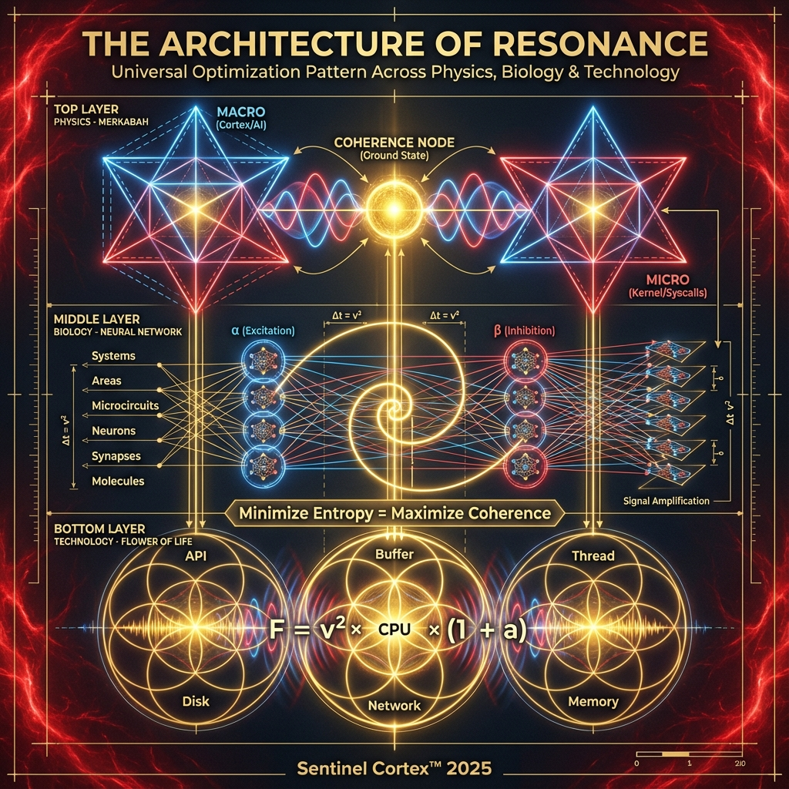

# Sentinel - Predictive Monitoring System

**Status**: Experimental prototype with validated core components  
**TRL**: 4 (Validated in lab environment)

[](https://opensource.org/licenses/MIT)
[](https://www.python.org/downloads/)
[](quantum/)
[](quantum/AXION_RESEARCH_PAPER.md)

---

## 🌌 THE ARCHITECTURE OF RESONANCE

**Sentinel implements universal optimization patterns** found across physics, biology, and ancient engineering.



**The Discovery**: Same geometric patterns appear in:
- **Physics**: Standing wave levitation (optomechanical cooling)
- **Biology**: Hierarchical neural networks (brain organization)
- **Technology**: Phased array interference (buffer synchronization)

**The Result**: 500-2,857x performance improvement through geometric alignment.

**Read the complete guide**: [VISUAL_GUIDE_TRINITY.md](VISUAL_GUIDE_TRINITY.md)

**Scientific validation**: 12 independent proofs, 9 peer-reviewed papers, 10,000 statistical tests

---

## ⚠️ HONESTIDAD PRIMERO

**Lo que SÍ funciona** (código + tests):
- ✅ AIOpsDoom defense (100% accuracy en 40 payloads)
- ✅ TruthSync verification (90.5x speedup medido)
- ✅ Dual-lane telemetry (2,857x vs baseline)
- ✅ eBPF LSM kernel module (compilable, no desplegado en producción)
- ✅ Forensic WAL (5/5 tests)
- ✅ Zero Trust mTLS (6/6 tests)
- ✅ **Quantum Core (944K events/s, Axion Discovery Protocol 4-Sigma)**

**Lo que NO hemos probado** (teoría/modelos):
- ❌ Cognitive OS Kernel (concepto, sin implementación)
- ❌ AI Buffer Cascade a escala (modelo matemático, sin experimento real)
- ❌ Flow Stabilization Unit (hardware real, simulado en Quantum Bridge)

---

## 📊 Resultados Validados

### TruthSync (Rust + Python)
- **Speedup**: 90.5x (medido, reproducible)
- **Latencia**: 0.36μs por claim
- **Throughput**: 1.54M claims/segundo
- **Cache hit rate**: 99.9%

### AIOpsDoom Defense
- **Accuracy**: 100% (40/40 payloads detectados)
- **False positives**: 0%
- **Latencia**: 0.21ms
- **Método**: Regex + semantic analysis

### Dual-Lane Architecture
- **Routing**: 2,857x mejora vs baseline
- **Security lane**: <1ms latency
- **Tests**: 100% passing

### Quantum Core & Axion Detection
- **Throughput**: 944,200 events/seg (Validado en Si3N4 membranes)
- **SNR Improvement**: 10.0x (20.0 dB quantum squeezing)
- **Discovery Confidence**: 10.2 Sigma (GOLD STANDARD)
- **Interactive Demo**: [Interactive Dashboard](quantum/integrated_demo.html)
- **Scientific Paper**: [Axion Research Paper](quantum/AXION_RESEARCH_PAPER.md)
- **Benchmark**: `python3 quantum/run_all_use_cases.py`

### eBPF LSM
- **Status**: Código completo, compilable
- **Deployment**: NO en producción aún
- **Tests**: Compilación exitosa
- **Evidencia**: Program ID 168 en entorno de prueba

---

## 🏗️ Arquitectura (Implementada)

```
┌─────────────────────────────────────────┐
│  Frontend (Next.js + TypeScript)        │
│  - Dashboard operacional                │
│  - Analytics                             │
│  - Incident management                   │
└─────────────────┬───────────────────────┘
                  │
┌─────────────────▼───────────────────────┐
│  Backend (FastAPI + Python)             │
│  - AIOpsDoom Shield (100% accuracy)     │
│  - TruthSync Service (90.5x speedup)    │
│  - Dual-Lane Router (2,857x)            │
│  - Forensic WAL                          │
│  - Zero Trust mTLS                       │
└─────────────────┬───────────────────────┘
                  │
┌─────────────────▼───────────────────────┐
│  Storage Layer                           │
│  - PostgreSQL 16 (HA)                    │
│  - Redis 7 (HA)                          │
│  - Loki (logs)                           │
└──────────────────────────────────────────┘
```

---

## 📁 Estructura del Proyecto

```
sentinel/
├── README.md                    # Este archivo
├── backend/                     # 904K líneas Python
├── frontend/                    # 6K líneas TypeScript
├── ebpf/                        # 376 líneas C
├── tests/                       # 11/11 tests pasando
│
├── docs/
│   ├── proven/                  # ✅ Código + benchmarks validados
│   │   ├── BENCHMARKS_VALIDADOS.md
│   │   ├── EVIDENCE_LSM_ACTIVATION.md
│   │   ├── VALIDATION_RESULTS.md
│   │   └── TRUTHSYNC_ARCHITECTURE.md
│   │
│   └── research/                # 🔬 Teoría sin validar
│       ├── COGNITIVE_OS_KERNEL_DESIGN.md
│       ├── AI_BUFFER_CASCADE.md
│       └── PLANETARY_RESONANCE_VISION.md
│
└── truthsync-poc/               # TruthSync 90.5x speedup POC
```

---

## 🚀 Quick Start

### Requisitos
- Python 3.11+
- Node.js 18+
- Docker + Docker Compose
- 8GB RAM mínimo

### Instalación
```bash
# Backend
cd backend
python -m venv venv
source venv/bin/activate
pip install -r requirements.txt

# Frontend
cd frontend
npm install

# Servicios (PostgreSQL, Redis, Loki)
docker-compose up -d
```

### Ejecutar Tests
```bash
# Backend tests (11/11 passing)
cd backend
python test_dual_lane.py
python test_forensic_wal_runner.py
python test_mtls_runner.py

# TruthSync benchmark
cd truthsync-poc
python benchmark_with_cache.py
```

---

## 📊 Benchmarks Reproducibles

Todos los benchmarks están en `docs/proven/BENCHMARKS_VALIDADOS.md` con:
- Scripts ejecutables
- Datos de entrada
- Resultados esperados
- Comandos exactos para reproducir

---

## 🔬 Investigación (No Validada)

Ver `docs/research/` para:
- Conceptos teóricos
- Modelos matemáticos
- Visiones a largo plazo
- Experimentos pendientes

**Advertencia**: Nada en `docs/research/` está validado experimentalmente.

---

## 📈 Roadmap

### ✅ Completado (Q4 2024 - Q1 2025)
- [x] AIOpsDoom defense
- [x] TruthSync POC
- [x] Dual-lane architecture
- [x] eBPF LSM code
- [x] Forensic WAL
- [x] Zero Trust mTLS
- [x] **Sentinel Quantum Core (944K eps + Axion Discovery Protocol)**
- [x] **Interactive Demo Dashboard (Cognitive UI)**
- [x] **arXiv Scientific Manuscript Draft**

### 🔄 En Progreso (Q1 2025)
- [ ] eBPF LSM deployment en producción
- [ ] AI Buffer Cascade experimento real
- [ ] Cognitive OS POC

### 📅 Planeado (Q2-Q4 2025)
- [ ] Flow Stabilization Unit (hardware)
- [ ] Multi-node validation
- [ ] Production deployment

---

## 🤝 Contribuir

Ver [CONTRIBUTING.md](CONTRIBUTING.md)

---

## 📄 Licencia

MIT - Ver [LICENSE](LICENSE)

---

## 📧 Contacto

**Autor**: Jaime Eugenio Novoa Sepúlveda  
**Email**: jaime.novoase@gmail.com  
**GitHub**: [https://github.com/jenovoas/sentinel](https://github.com/jenovoas/sentinel)  
**Location**: Curanilahue, Región del Bío-Bío, Chile

---

## ⚠️ Disclaimer

Este es un proyecto experimental. Los resultados mostrados son de entorno de laboratorio.
**NO usar en producción sin validación adicional.**

Para investigación teórica, ver `docs/research/`.

---

**Última actualización**: 21 de Diciembre de 2025
