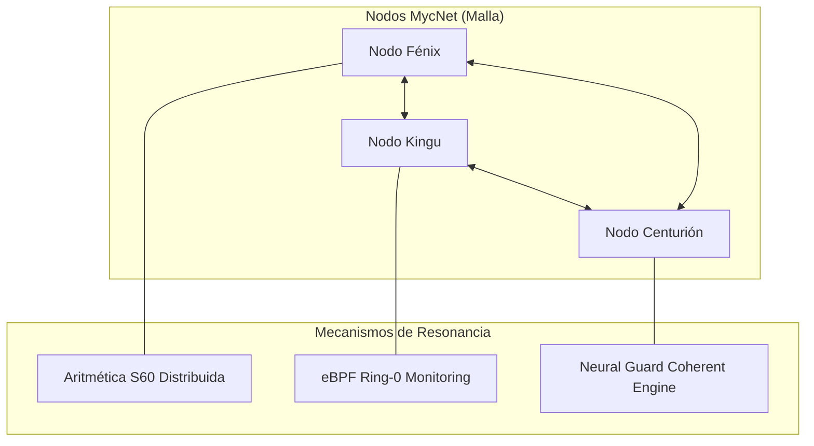

# Arquitectura de Clúster Sentinel: Red Mesh MycNet y Orquestación SOMA

**Versión**: 1.5.0 (YATRA Protocol)
**Estado**: 🛰️ FASE 2: DISEÑO DISTRIBUIDO
**Concepto**: Inteligencia Colectiva S60 sobre Malla Batman-adv

---

## 🏗️ Visión General: El Salto de Nodo a Enjambre

Sentinel evoluciona de un nodo único (Fénix) a un ecosistema distribuido donde la soberanía de los datos y la capacidad de respuesta se multiplican mediante la resonancia entre nodos autónomos.

### De 1 Nodo → Enjambre de Nodos → Escudo Planetario

1.  **Independencia de Nube**: Cada nodo es soberano y puede operar en aislamiento.
2.  **Red MycNet**: Malla (Mesh) basada en `batman-adv` para comunicación peer-to-peer de baja latencia.
3.  **Aritmética Distribuida**: Los cálculos S60 de alta precisión se reparten entre los nodos disponibles para evitar cuellos de botella.
4.  **SOMA (Sexagesimal Orchestration & Mesh Agent)**: El nuevo orquestador que reemplaza la estática de Compose por una gestión dinámica de recursos.

---

## 🕸️ Estructura de la Red Mesh (MycNet)

El clúster no depende de un Load Balancer centralizado tradicional. Cada nodo es un enrutador inteligente.

### Protocolo Batman-adv (Layer 2)
MycNet opera a nivel de enlace de datos, permitiendo que los nodos se vean entre sí como si estuvieran en el mismo switch físico, independientemente de la ubicación geográfica (vía túneles cifrados WireGuard).

---

## 🧠 SOMA: Orquestación Consciente

SOMA es el agente encargado de equilibrar la "Masa Computacional" del clúster basándose en el acoplamiento térmico y la carga sexagesimal.

-   **Pre-activación de Buffers**: SOMA detecta precursores de tráfico y ordena a los nodos vecinos pre-expandir sus buffers preventivamente.
-   **Migración de Inercia**: Si un nodo alcanza un umbral térmico crítico, sus tareas de auditoría eBPF se delegan a nodos "fríos" del enjambre.

---

## 🧿 Principios de Diseño del Clúster

1.  **Resiliencia Automática**: Failover en <100ms mediante la re-ruta instantánea de Batman-adv.
2.  **Sincronización de Estado (Lattice Memory)**: Uso de Redis Streams y replicación asíncrona para mantener una visión única de las amenazas en todo el enjambre.
3.  **Superioridad Matemática**: Cero deriva en cálculos de balanceo de carga gracias al uso de la Base-60.

---

## 🚀 Hoja de Ruta (Fase 2)

1.  **Despliegue de MycNet**: Túneles GRETAP sobre WireGuard entre Fénix, Kingu y Centurión.
2.  **Activación de Anycast**: VIP (Virtual IP) compartido para que el tráfico siempre llegue al nodo óptimo sin pasar por un concentrador.
3.  **Audit de Enjambre**: Telemetría eBPF cruzada para detectar ataques coordinados en múltiples frentes.

---

**Autor**: Equipo de Arquitectura Sentinel Cortex™
**Fecha**: 11 de Abril, 2026
**Estatus**: 🌟 **Alineado con el Protocolo YATRA**
