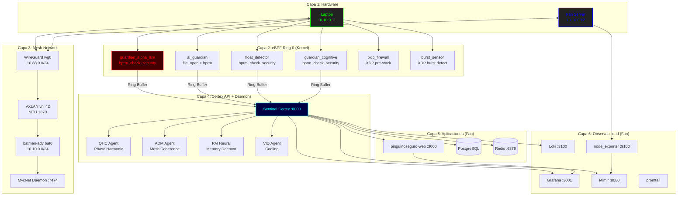

# Arquitectura del Sistema Sentinel

**Versión**: 2.0.0 (Mesh + eBPF Ring-0 / me-60os)
**Última actualización**: 2026-07-28
**Contacto**: Jaime Novoa jaime.novoase@gmail.com

Este documento describe la arquitectura de software y despliegue del proyecto Sentinel. Cubre el despliegue actual (Laptop ↔ Fan en mesh, con eBPF Ring-0) y la visión a futuro.

---

## 1. Arquitectura de Producción Actual (Fase 2: Mesh Multi-Nodo + eBPF Ring-0)

La infraestructura actual consiste en dos nodos — **Laptop** (estación de desarrollo) y **Fan** (servidor remoto) — conectados mediante una red mesh batman-adv sobre WireGuard + VXLAN. El kernel ejecuta 7 programas eBPF en Ring-0 para seguridad LSM/XDP, y los daemons me-60os operan en userspace con aritmética S60.

### 1.1. Diagrama de Capas (Stack Completo)

### 1.2. Capa 1 — Red Mesh (WireGuard + VXLAN + batman-adv)

| Componente | Laptop | Fan |
|-----------|--------|-----|
| WireGuard (wg0) | 10.88.0.2/24 | 10.88.0.1/24 |
| VXLAN (vxlan0) | VNI 42, MTU 1370 | VNI 42, MTU 1370 |
| batman-adv (bat0) | 10.10.0.11/24 | 10.10.0.12/24 |
| MycNet Daemon | :7474 (local) | :7474 (vía SSH) |

La mesh se configura mediante `mycnet/scripts/mesh_setup.sh`.

### 1.3. Capa 2 — eBPF Ring-0 (Kernel Linux)

Siete programas eBPF cargados en el kernel, pineados en `/sys/fs/bpf/`:

| Programa | Hook | Propósito | Tamaño |
|----------|------|-----------|--------|
| `guardian_alpha_lsm` | `bprm_check_security` | Whitelist path-based de AI agents | 13,488 B |
| `ai_guardian` | `file_open` + `bprm_check_security` | AI agent exec blocking | 752 B |
| `me60os_ai_guardian_open` | `file_open` | AI file access control | 1,696 B |
| `guardian_cognitive` | `bprm_check_security` | Análisis semántico de argumentos | 33,376 B |
| `float_detector` | `bprm_check_security` | YATRA Lock: detecta floats | 2,208 B |
| `xdp_firewall_prog` | XDP | Firewall pre-stack, panic mode | — |
| `detect_burst` (burst_sensor) | XDP | Detección de ráfagas de tráfico | 576 B |

**Modo Dios:** UID 1000 (jnovoas) exento vía mapa `god_mode_uids`.
**Whitelist:** 39 bins en `whitelist_map`, 28 bins en `ai_whitelist_map`.

### 1.4. Capa 3 — MycNet Daemon

El daemon `mycnetd` (Rust, puerto 7474) gestiona la topología de la mesh, recolecta métricas de batman-adv y expone un endpoint Prometheus. Corre localmente y de forma remota en Fan vía SSH.

### 1.5. Capa 4 — Cortex API + Daemons me-60os

**Sentinel Cortex** (Rust/Axum, puerto 8000):
- `GET /health` — Health check + métricas de resonancia
- `GET /api/v1/telemetry` — WebSocket: stream de eventos eBPF
- `GET /api/v1/sentinel_status` — Estado del ring
- `POST /api/v1/truth_claim` — Verificación de claims de AI
- Echo Bridge: eventos eBPF → `broadcast::channel` → `ResonantLatticeBridge` (64 nodos)
- Suscripción Redis a `sentinel:bio_pulse` para bio-sync remoto

**Daemons me-60os** (Rust, binarios en `me-60os/target/release/`):

| Daemon | Función |
|--------|---------|
| `qhc_agent` | Phase Harmonic Driver: patrón YHWH 10-5-6-5 |
| `adm_agent` | Axial Diffusion Model: lectura batctl, coherencia mesh |
| `pai_neural_daemon` | Neural Memory: lee ring buffer de guardian |
| `vid_agent` | Cooling Agent |

### 1.6. Capa 5 — Servicios de Aplicación (Fan)

- **pinguinoseguro-web** (Next.js, puerto 3000)
- **PostgreSQL** (sistema) con DB `sentinel_db`
- **Redis** (contenedor, puerto 6379)

### 1.7. Capa 6 — Observabilidad (Fan)

| Servicio | Puerto | Propósito |
|----------|--------|-----------|
| node_exporter | 9100 | Métricas de sistema |
| Loki | 3100 | Agregación de logs |
| Mimir | 8080 | Almacenamiento métricas (Prometheus-compatible) |
| Grafana | 3001 | Dashboards (admin/admin, datasources: Loki + Mimir) |
| promtail | — | Forwarder de logs → Loki |

Dashboard: "SecurePenguin — Monitoreo" (creado). Swarm dashboard JSON en `docs/swarm_dashboard_grafana.json`.

### 1.8. Systemd Services

| Servicio | Descripción | Archivo |
|----------|-------------|---------|
| sentinel-cortex.service | API Cortex | `systemd/sentinel-cortex.service` |
| sentinel-ebpf-forwarder.service | eBPF tracelog → Loki | `systemd/sentinel-ebpf-forwarder.service` |
| sentinel-qhc-agent.service | QHC Agent | `systemd/sentinel-qhc-agent.service` |
| mycnet-interceptor.service | Métricas mesh → Redis | `mycnet/systemd/mycnet-interceptor.service` |
| audit-watchdog.service | Watchdog de auditd | `systemd/audit-watchdog.service` |
| process-memory-collector.service | Métricas de memoria | `systemd/process-memory-collector.service` |
| audit-watchdog-quantum.service | Watchdog cuántico | `systemd/audit-watchdog-quantum.service` |

---

## 2. Arquitectura Objetivo (Fase 3: Cluster Multi-Nodo)

La visión a futuro del proyecto es escalar más allá del par Laptop ↔ Fan hacia un clúster distribuido y resiliente.

### 2.1. Conceptos Clave

*   **Multi-Nodo:** Desplegar instancias de Sentinel en múltiples servidores (ej. Fan, Kingu, Centurion) para alta disponibilidad y balanceo de carga.
*   **MycNet (Mesh Network):** Red de malla para comunicación descentralizada entre nodos, compartiendo estado y carga de trabajo.
*   **Computación Distribuida S60:** Cálculos de aritmética sexagesimal distribuidos donde cada nodo aporta capacidad de cómputo.
*   **Cortex Federado:** Múltiples instancias de Cortex compartiendo eventos eBPF a través del bus Redis.

---

## 3. Conceptos Fundamentales de la Arquitectura

Independientemente de la fase de despliegue, Sentinel se basa en los siguientes principios:

### 3.1. Aritmética Sexagesimal (Base-60)

El núcleo del sistema evita el uso de punto flotante (IEEE 754) para cálculos críticos, utilizando en su lugar una implementación de aritmética de punto fijo en base-60.
*   **Problema:** El punto flotante binario no puede representar exactamente fracciones como 1/3 o 1/10, acumulando errores.
*   **Solución:** La Base-60 es divisible por 3 y 10, permitiendo cálculos exactos sin deriva.
*   **Implementación:** El crate de Rust `me-60os` y las librerías de Python en `quantum/` contienen las implementaciones de los tipos `S60` y sus operaciones.

### 3.2. Acoplamiento Octomecánico y `neural-guard`

La lógica de defensa del sistema (`neural-guard`, ahora integrada en `cortex`) es adaptable y sensible al estado físico del hardware.
*   **Conciencia Térmica:** El sistema monitorea la temperatura de la CPU.
*   **Umbrales Dinámicos:** La sensibilidad de las alertas de seguridad (ej. intentos de login fallidos) cambia con la temperatura. Un sistema más "caliente" (con más carga) se vuelve menos sensible para evitar falsos positivos, mientras que un sistema "frío" opera con máxima sensibilidad.
