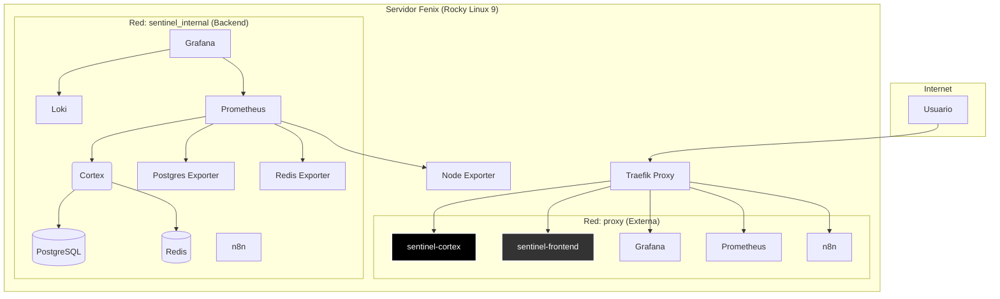

# Arquitectura del Sistema Sentinel

**Versión**: 1.2.0 (S60-Unified / Fenix Native)
**Contacto**: Jaime Novoa jaime.novoase@gmail.com

Este documento describe la arquitectura de software y despliegue del proyecto Sentinel. Está dividido en el estado actual de producción y la visión a futuro.

---

## 1. Arquitectura de Producción Actual (Fase 1: Nodo Único Fenix)

La infraestructura de producción actual reside en un único servidor llamado **Fenix**, orquestado con Podman y Traefik. El núcleo de la aplicación ha sido migrado de Python a Rust para mayor rendimiento y seguridad.

### 1.1. Diagrama de Componentes (Fenix)

### 1.2. Descripción de Servicios Clave

*   **Traefik (Reverse Proxy):** Punto de entrada único. Maneja todo el tráfico TLS/SSL, obtiene certificados automáticamente y enruta las peticiones a los servicios correspondientes usando *labels* de Podman.
*   **sentinel-cortex (Rust/Axum):** El nuevo corazón del sistema. Reemplaza al antiguo backend de Python.
    *   Expone la API principal.
    *   Integra la lógica del `neural-guard` para la toma de decisiones de seguridad.
    *   Se comunica con la base de datos y el caché.
*   **sentinel-frontend (Next.js):** La interfaz de usuario, servida como una aplicación React.
*   **Stack de Observabilidad:**
    *   **Prometheus:** Recolecta métricas de todos los servicios a través de *exporters*.
    *   **Loki:** Agrega logs de los contenedores.
    *   **Grafana:** Proporciona dashboards para visualizar métricas y logs.
*   **Base de Datos y Caché:** PostgreSQL como base de datos principal y Redis para caché y mensajería.
*   **Podman:** El motor de contenedores (en lugar de Docker), corriendo en modo *rootless* por seguridad.

---

## 2. Arquitectura Objetivo (Fase 2: Cluster Multi-Nodo)

La visión a futuro del proyecto es evolucionar desde un nodo único a un clúster distribuido y resiliente. Esta fase aún está en diseño.

### 2.1. Conceptos Clave

*   **Multi-Nodo:** Desplegar instancias de Sentinel en múltiples servidores (ej. Fenix, Kingu, Centurion) para alta disponibilidad y balanceo de carga.
*   **MycNet (Mesh Network):** Implementar una red de malla para que los nodos se comuniquen directamente, compartiendo estado y carga de trabajo de forma descentralizada.
*   **Computación Distribuida S60:** Utilizar la red de malla para realizar cálculos de aritmética sexagesimal distribuidos, donde cada nodo aporta parte de la capacidad de cómputo.

---

## 3. Conceptos Fundamentales de la Arquitectura

Independientemente de la fase de despliegue, Sentinel se basa en los siguientes principios:

### 3.1. Aritmética Sexagesimal (Base-60)

El núcleo del sistema evita el uso de punto flotante (IEEE 754) para cálculos críticos, utilizando en su lugar una implementación de aritmética de punto fijo en base-60.
*   **Problema:** El punto flotante binario no puede representar exactamente fracciones como 1/3 o 1/10, acumulando errores.
*   **Solución:** La Base-60 es divisible por 3 y 10, permitiendo cálculos exactos sin deriva.
*   **Implementación:** El crate de Rust `me-60os` y las librerías de Python en `quantum/` contienen las implementaciones de los tipos `S60` y sus operaciones.

### 3.2. Acoplamiento Octomecánico y `neural-guard`

La lógica de defensa del sistema (`neural-guard`, ahora integrada en `cortex`) es adaptable y sensible al estado físico del hardware.
*   **Conciencia Térmica:** El sistema monitorea la temperatura de la CPU.
*   **Umbrales Dinámicos:** La sensibilidad de las alertas de seguridad (ej. intentos de login fallidos) cambia con la temperatura. Un sistema más "caliente" (con más carga) se vuelve menos sensible para evitar falsos positivos, mientras que un sistema "frío" opera con máxima sensibilidad.
