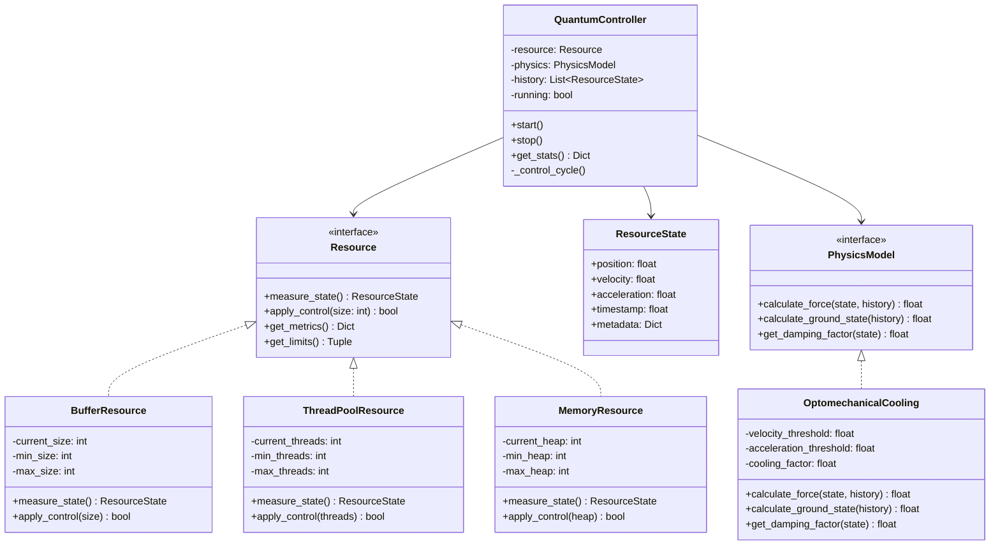
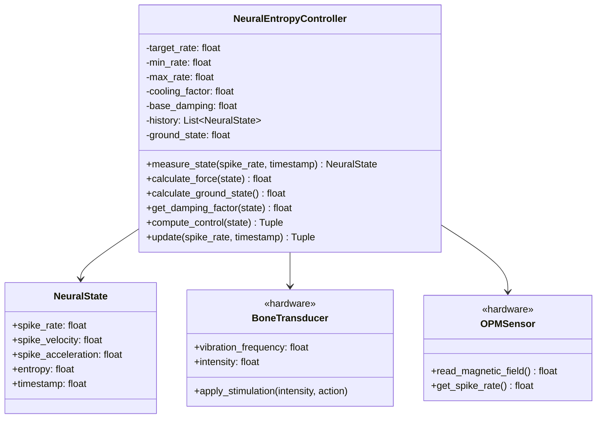
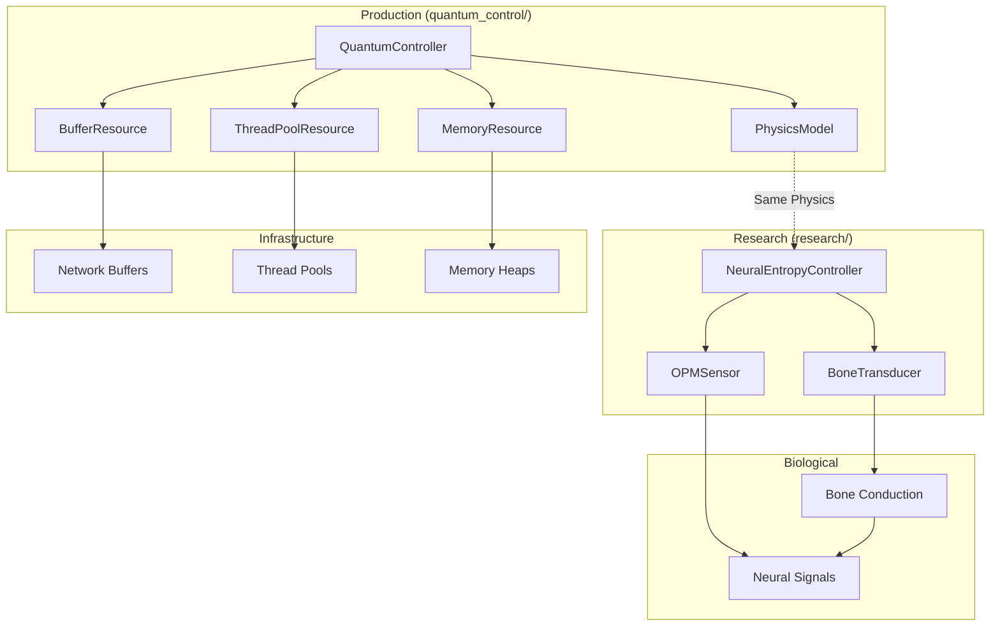
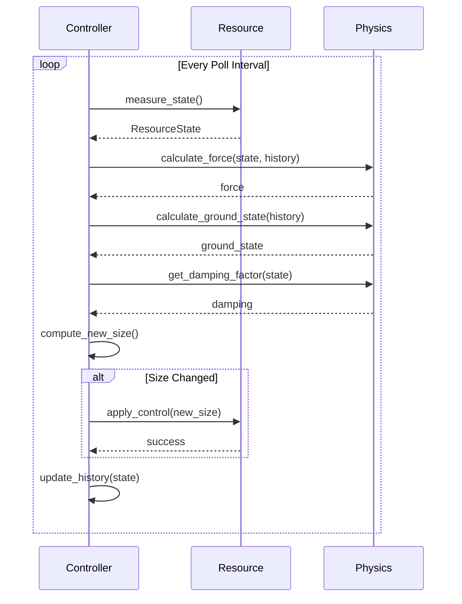
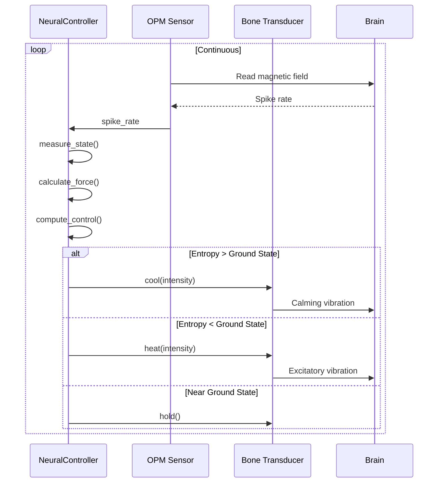
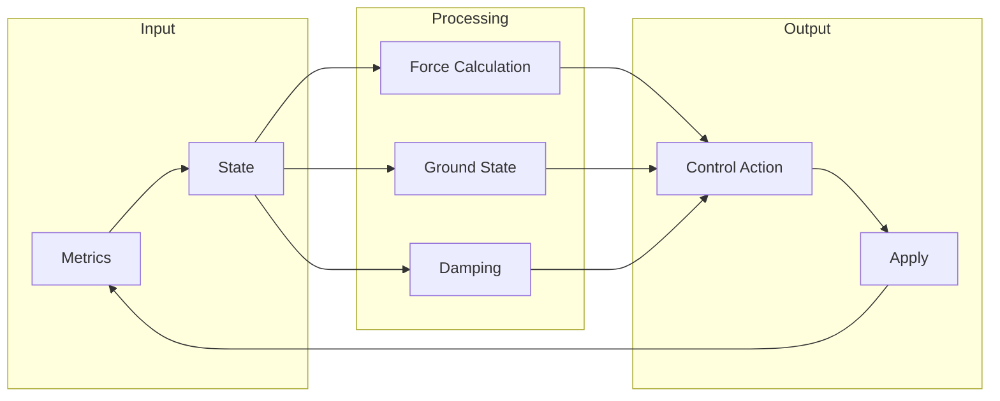
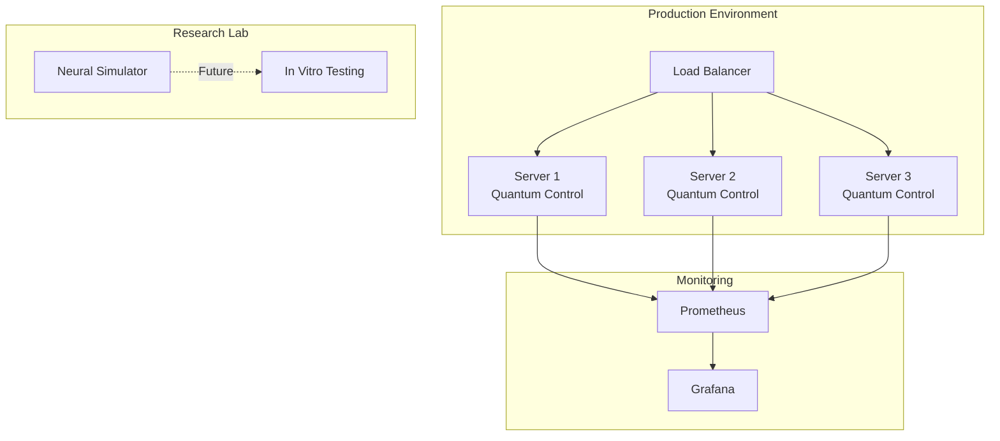
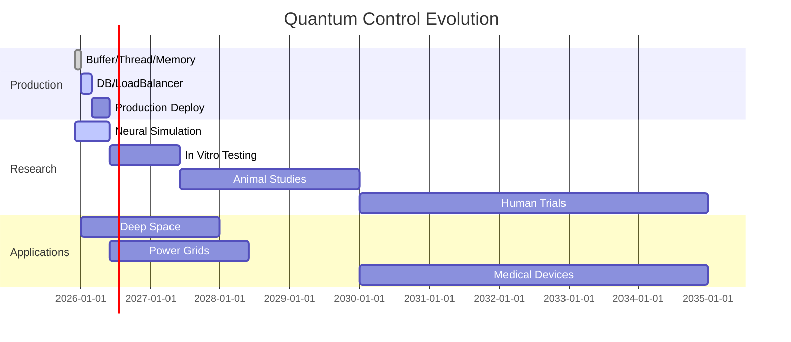

# Architecture Diagrams - UML

Comprehensive UML diagrams for all systems.

---

## 1. Quantum Control Framework - Class Diagram



---

## 2. Neural Interface - Class Diagram



---

## 3. System Architecture - Component Diagram



---

## 4. Control Flow - Sequence Diagram



---

## 5. Neural Control Flow - Sequence Diagram



---

## 6. Data Flow - Architecture Diagram



---

## 7. The Trinity - Conceptual Diagram

```mermaid
graph TD
    subgraph Trinity["E = mc²"]
        E[Energy<br/>MemoryResource]
        M[Mass<br/>BufferResource]
        C[Speed²<br/>ThreadResource²]
    end
    
    subgraph Physics["Same Physics"]
        OM[OptomechanicalCooling<br/>F = v² × (1 + a)]
    end
    
    subgraph Result["Throughput"]
        T[Throughput = Space × Time²]
    end
    
    M --> OM
    C --> OM
    E --> OM
    
    OM --> T
```

---

## 8. Deployment Architecture



---

## 9. Evolution Timeline



---

All diagrams use Mermaid syntax for easy rendering in Markdown.
