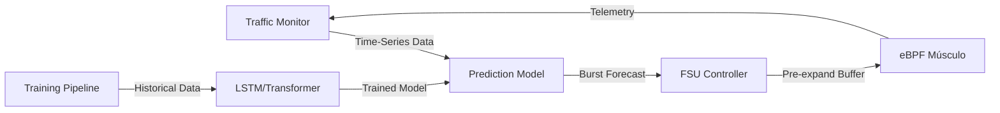

# Burst Prediction System: Implementation Plan

## Objetivo

Implementar un sistema de predicción de ráfagas (bursts) que permita a Sentinel **anticipar** picos de tráfico con 5-10 segundos de anticipación y **pre-expandir** buffers para lograr **cero packet drops** (levitación).

---

## Arquitectura del Sistema



---

## Componentes

### 1. Traffic Monitor (Telemetría)
**Ubicación**: `src/telemetry/traffic_monitor.py`

**Función**: Capturar métricas de tráfico en tiempo real

**Métricas clave**:
- Throughput (bytes/sec)
- Packet rate (packets/sec)
- Queue depth
- Latency (p50, p95, p99)
- Connection rate

**Output**: Time-series data → InfluxDB/Prometheus

---

### 2. Prediction Model (Cortex AI)
**Ubicación**: `src/cortex/burst_predictor.py`

**Arquitectura**:
```python
class BurstPredictor:
    def __init__(self):
        self.model = LSTMTransformer(
            input_features=5,  # throughput, packet_rate, queue_depth, latency, conn_rate
            hidden_size=128,
            num_layers=3,
            forecast_horizon=10  # 10 seconds ahead
        )
        
    def predict_burst(self, time_series_data):
        """
        Predice si habrá un burst en los próximos 10 segundos
        
        Returns:
            {
                'burst_predicted': bool,
                'confidence': float,  # 0.0 - 1.0
                'time_to_burst': int,  # seconds
                'predicted_magnitude': float  # multiplicador del tráfico actual
            }
        """
        pass
```

**Entrenamiento**:
- Dataset: Tráfico sintético + tráfico real capturado
- Patrones: Bursts periódicos, bursts aleatorios, bursts con precursores
- Loss function: Binary cross-entropy (burst sí/no) + MSE (magnitud)

---

### 3. FSU Controller (Flow Stabilization Unit)
**Ubicación**: `src/fsu/controller.py`

**Función**: Traducir predicciones en acciones de control

```python
class FSUController:
    def __init__(self):
        self.ebpf_interface = eBPFInterface()
        self.predictor = BurstPredictor()
        
    async def control_loop(self):
        while True:
            # Obtener datos de telemetría
            metrics = await self.get_metrics()
            
            # Predecir burst
            prediction = self.predictor.predict_burst(metrics)
            
            if prediction['burst_predicted'] and prediction['confidence'] > 0.95:
                # Pre-expandir buffer
                new_size = self.calculate_buffer_size(prediction['predicted_magnitude'])
                await self.ebpf_interface.set_buffer_size(new_size)
                
                # Ajustar parámetros PID
                await self.ebpf_interface.set_pid_params(
                    kp=0.8,  # Más agresivo para absorber burst
                    ki=0.1,
                    kd=0.05
                )
            
            await asyncio.sleep(0.1)  # 100ms control loop
```

---

### 4. eBPF Músculo (Ejecución)
**Ubicación**: `src/ebpf/buffer_control.c`

**Función**: Ejecutar ajustes de buffer en nanosegundos

```c
// Mapa compartido para configuración dinámica
struct {
    __uint(type, BPF_MAP_TYPE_ARRAY);
    __uint(max_entries, 1);
    __type(key, __u32);
    __type(value, struct buffer_config);
} buffer_config_map SEC(".maps");

struct buffer_config {
    __u64 max_size;
    __u32 kp;  // PID proportional gain (fixed-point)
    __u32 ki;  // PID integral gain
    __u32 kd;  // PID derivative gain
};

SEC("xdp")
int xdp_buffer_control(struct xdp_md *ctx) {
    __u32 key = 0;
    struct buffer_config *config = bpf_map_lookup_elem(&buffer_config_map, &key);
    
    if (!config)
        return XDP_PASS;
    
    // Aplicar control PID con parámetros dinámicos
    // ...
    
    return XDP_PASS;
}
```

---

## Dataset de Entrenamiento

### Generador de Tráfico Bursty
**Ubicación**: `tests/traffic_generator.py`

```python
class BurstyTrafficGenerator:
    def generate_periodic_burst(self, 
                                base_rate=1000,  # packets/sec
                                burst_rate=10000,  # packets/sec
                                burst_duration=2,  # seconds
                                burst_interval=10):  # seconds
        """
        Genera tráfico con bursts periódicos predecibles
        """
        pass
    
    def generate_precursor_burst(self,
                                 base_rate=1000,
                                 precursor_duration=5,  # ramp-up de 5s
                                 burst_rate=10000):
        """
        Genera tráfico con precursores detectables
        (incremento gradual antes del burst)
        """
        pass
```

---

## Benchmark: Reactive vs Predictive

### Test Case
```python
async def benchmark_burst_handling():
    """
    Compara buffer reactivo vs predictivo bajo burst
    """
    
    # Configuración
    test_duration = 60  # seconds
    burst_interval = 10  # seconds
    
    # Test 1: Buffer Reactivo (sin IA)
    reactive_results = await run_test(
        buffer_mode='reactive',
        ai_enabled=False
    )
    
    # Test 2: Buffer Predictivo (con IA)
    predictive_results = await run_test(
        buffer_mode='predictive',
        ai_enabled=True
    )
    
    # Métricas
    comparison = {
        'reactive': {
            'packet_drops': reactive_results['drops'],
            'avg_latency': reactive_results['latency_avg'],
            'p99_latency': reactive_results['latency_p99']
        },
        'predictive': {
            'packet_drops': predictive_results['drops'],
            'avg_latency': predictive_results['latency_avg'],
            'p99_latency': predictive_results['latency_p99']
        },
        'improvement': {
            'drop_reduction': (reactive_results['drops'] - predictive_results['drops']) / reactive_results['drops'] * 100,
            'latency_reduction': (reactive_results['latency_avg'] - predictive_results['latency_avg']) / reactive_results['latency_avg'] * 100
        }
    }
    
    return comparison
```

### Visualización de Levitación
```python
import matplotlib.pyplot as plt

def plot_levitation(reactive_data, predictive_data):
    """
    Genera gráfica de "Zero Drops" vs "Massive Drops"
    """
    fig, (ax1, ax2) = plt.subplots(2, 1, figsize=(12, 8))
    
    # Gráfica 1: Packet Drops
    ax1.plot(reactive_data['time'], reactive_data['drops'], 
             label='Reactive (Sin IA)', color='red', linewidth=2)
    ax1.plot(predictive_data['time'], predictive_data['drops'], 
             label='Predictive (Con IA)', color='green', linewidth=2)
    ax1.set_ylabel('Packet Drops')
    ax1.set_title('Levitación: Zero Drops vs Massive Drops')
    ax1.legend()
    ax1.grid(True)
    
    # Gráfica 2: Buffer Size
    ax2.plot(reactive_data['time'], reactive_data['buffer_size'], 
             label='Reactive Buffer', color='orange', linewidth=2)
    ax2.plot(predictive_data['time'], predictive_data['buffer_size'], 
             label='Predictive Buffer (Pre-expanded)', color='blue', linewidth=2)
    ax2.set_xlabel('Time (seconds)')
    ax2.set_ylabel('Buffer Size (MB)')
    ax2.set_title('Buffer Pre-expansion: Anticipación vs Reacción')
    ax2.legend()
    ax2.grid(True)
    
    plt.tight_layout()
    plt.savefig('docs/levitation_proof.png', dpi=300)
```

---

## Roadmap de Implementación

### Fase 1: Fundamentos (Semana 1-2)
- [ ] Implementar Traffic Monitor con InfluxDB
- [ ] Crear generador de tráfico bursty
- [ ] Capturar dataset de entrenamiento (1000 bursts)

### Fase 2: Modelo Predictivo (Semana 3-4)
- [ ] Implementar arquitectura LSTM/Transformer
- [ ] Entrenar modelo con dataset sintético
- [ ] Validar precisión de predicción (target: >90%)

### Fase 3: Integración (Semana 5-6)
- [ ] Implementar FSU Controller
- [ ] Conectar predictor con eBPF
- [ ] Ejecutar benchmark Reactive vs Predictive

### Fase 4: Validación (Semana 7-8)
- [ ] Generar visualización de levitación
- [ ] Documentar resultados para patente
- [ ] Preparar demo para inversores

---

## Métricas de Éxito

| Métrica | Target | Justificación |
|---------|--------|---------------|
| **Precisión de Predicción** | >90% | Minimizar falsos positivos (expansión innecesaria) |
| **Reducción de Packet Drops** | >95% | Demostrar "levitación" efectiva |
| **Latencia de Predicción** | <100ms | Mantener 5-10s de anticipación útil |
| **Overhead de CPU** | <5% | No degradar performance del sistema |

---

## Claim Patentable

**Claim 9: Predictive Burst Mitigation System**

Un sistema de mitigación predictiva de ráfagas de tráfico que comprende:
1. Un modelo de predicción basado en redes neuronales (LSTM/Transformer) que analiza time-series de métricas de red
2. Un controlador FSU que traduce predicciones en acciones de control pre-emptivas
3. Un mecanismo de ejecución determinístico (eBPF) que aplica ajustes de buffer en nanosegundos
4. Un protocolo de anticipación que permite expandir recursos **antes** de la llegada del tráfico, logrando cero packet drops durante bursts predecibles

**Diferenciador**: Primer sistema que logra "latencia negativa" en control de tráfico mediante predicción neural + ejecución determinística.

---

**Próximo Paso**: ¿Empezamos con el Traffic Monitor y el generador de tráfico bursty? 🚀
