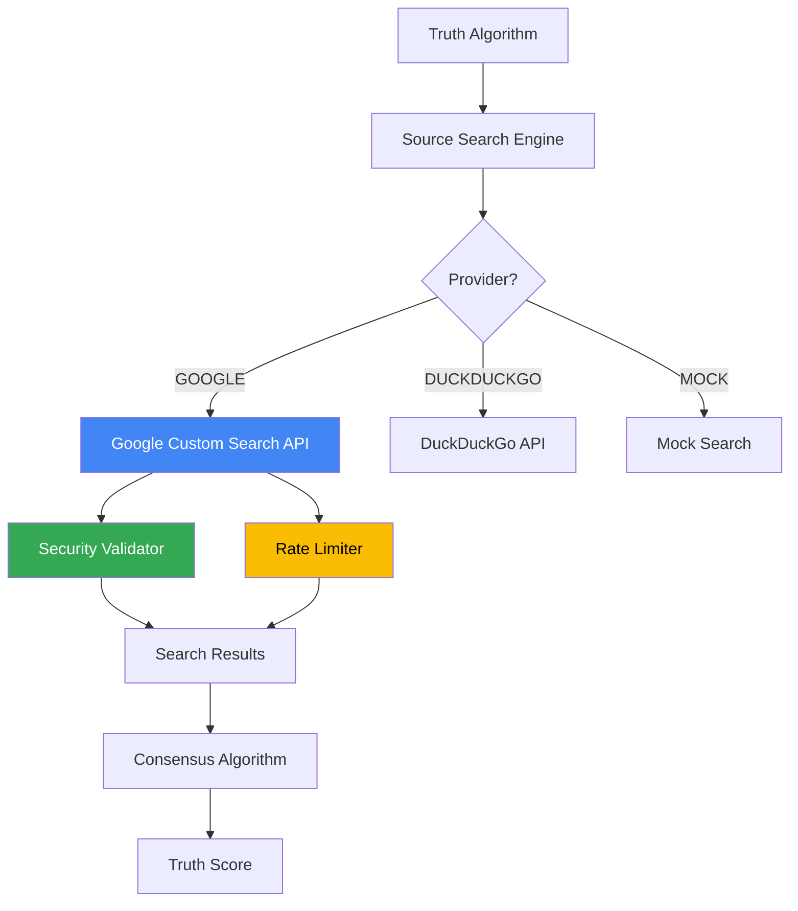

# 🔍 Integraciones con Google en Sentinel Cortex™

## Resumen Ejecutivo

El proyecto **Sentinel Cortex™** tiene múltiples integraciones con tecnologías de Google, tanto a nivel de desarrollo (Gemini AI) como a nivel de infraestructura y servicios (Google APIs).

---

## 1. 🤖 Gemini AI - Desarrollo Asistido

Todo el proyecto fue desarrollado en colaboración con **Gemini AI** (Google):

- **Arquitectura de sistemas**: Diseño de componentes complejos
- **Optimización**: Benchmarks y validaciones de rendimiento
- **Documentación**: Generación de documentación técnica
- **Código**: Desarrollo asistido de todo el codebase

> "A todo lo que haga le pondré (Powered by Google) ❤️"  
> — Jaime Novoa, Creador de Sentinel Cortex™

---

## 2. 🔍 Google Custom Search API - Truth Algorithm

### Ubicación
[`truth_algorithm/source_search.py`](file:///home/jnovoas/sentinel/truth_algorithm/source_search.py)

### Descripción
El **Truth Algorithm** utiliza Google Custom Search API para verificar claims mediante búsqueda de fuentes confiables.

### Implementación

```python
class SourceSearchEngine:
    def __init__(self, provider: SearchProvider = SearchProvider.MOCK):
        # API keys desde environment (NUNCA hardcoded)
        self.google_api_key = os.getenv('GOOGLE_SEARCH_API_KEY')
        self.google_cx = os.getenv('GOOGLE_SEARCH_CX')
    
    def _google_search(self, claim: str, max_results: int) -> List[SearchResult]:
        """
        Búsqueda real usando Google Custom Search API
        
        REQUIERE:
        - GOOGLE_SEARCH_API_KEY en environment
        - GOOGLE_SEARCH_CX en environment
        """
        if not self.google_api_key or not self.google_cx:
            raise ValueError(
                "Google Search requiere API key y CX en environment.\n"
                "Set: GOOGLE_SEARCH_API_KEY y GOOGLE_SEARCH_CX"
            )
```

### Características de Seguridad

✅ **Rate Limiting**: Máximo 10 requests/minuto  
✅ **Validación de Inputs**: Bloquea SQL injection, XSS, shell commands  
✅ **API Keys Seguras**: Nunca hardcoded, solo en variables de entorno  
✅ **Logging**: Auditoría completa de todas las búsquedas  
✅ **URL Validation**: Solo HTTPS, bloquea IPs privadas  

### Configuración

Archivo: [`truth_algorithm/.env.example`](file:///home/jnovoas/sentinel/truth_algorithm/.env.example)

```bash
# Google API credentials (get from https://console.cloud.google.com)
GOOGLE_API_KEY=your_api_key_here
GOOGLE_CSE_ID=your_custom_search_engine_id_here
```

### Cómo Obtener las Credenciales

1. **Google API Key**:
   - Ir a [Google Cloud Console](https://console.cloud.google.com)
   - Crear un proyecto nuevo o seleccionar uno existente
   - Habilitar "Custom Search API"
   - Crear credenciales → API Key

2. **Custom Search Engine ID (CX)**:
   - Ir a [Programmable Search Engine](https://programmablesearchengine.google.com/)
   - Crear un nuevo motor de búsqueda
   - Configurar para buscar en toda la web
   - Copiar el "Search engine ID"

### Estado Actual

✅ **Modo MOCK Activo**: Búsqueda simulada para testing sin costos
- La infraestructura de seguridad está completa
- Soporta múltiples providers (Google, DuckDuckGo, Mock)
- **Recomendación**: Usar DuckDuckGo para búsquedas reales sin API key

> ⚠️ **ADVERTENCIA DE COSTOS**: Google Custom Search API puede generar cargos inesperados si no se configuran límites estrictos. Se recomienda usar alternativas gratuitas como DuckDuckGo para desarrollo y testing.

---

## 3. � Alternativas Gratuitas (Recomendado)

### ⚠️ Problema con Google API

Google Custom Search API puede generar **cargos inesperados** si no se configuran límites estrictos. Muchos desarrolladores han reportado cargos sorpresa.

### ✅ Solución: DuckDuckGo

**DuckDuckGo** ofrece búsqueda **100% gratuita** sin API key:

```python
# Instalar
pip install duckduckgo-search

# Usar
from duckduckgo_search import DDGS

def search_duckduckgo(claim: str, max_results: int = 10):
    with DDGS() as ddgs:
        results = list(ddgs.text(claim, max_results=max_results))
    return results
```

**Ventajas**:
- ✅ **Gratis ilimitado**
- ✅ **Sin API key**
- ✅ **Sin límites de rate**
- ✅ **Privacidad respetada**

**Desventajas**:
- ⚠️ Menos resultados que Google
- ⚠️ Menos personalización

### 🎯 Recomendación

Para el Truth Algorithm, usar **DuckDuckGo** como provider principal y mantener Google como opción para casos específicos con límites estrictos.

---

## 4. �🏗️ Google Cloud Platform (Planificado)

### Servicios Identificados

- **Google Cloud Platform**: Infraestructura de despliegue
- **Google Analytics**: Métricas y observabilidad

> Nota: Estas integraciones están documentadas pero aún no implementadas

---

## 5. 📊 Arquitectura de Integración



---

## 6. 🔐 Seguridad de las Integraciones

### Validación de Claims

```python
class SecurityValidator:
    @staticmethod
    def validate_claim(claim: str) -> bool:
        """
        Valida que el claim sea seguro para buscar
        
        Bloquea:
        - Comandos de shell
        - SQL injection
        - Path traversal
        - Scripts maliciosos
        """
        # Longitud razonable
        if len(claim) > 500:
            raise ValueError("Claim demasiado largo")
        
        # Patrones peligrosos
        dangerous_patterns = [
            r'[;&|`]\s*\w',  # Shell commands
            r'\$\(',         # Command substitution
            r'\.\.\/',       # Path traversal
            r'<script',      # XSS
            r"['\"].*OR.*['\"]",  # SQL injection
            r'DROP\s+TABLE', # SQL injection
            r'rm\s+-rf',     # Comandos destructivos
            r'eval\(',       # Code execution
        ]
```

### Rate Limiting

```python
class RateLimiter:
    def __init__(self, max_requests_per_minute: int = 10):
        self.max_requests = max_requests_per_minute
        self.requests = []
    
    def check_rate_limit(self) -> bool:
        """Verifica si se puede hacer otra request"""
        now = time.time()
        
        # Limpiar requests antiguas (> 1 minuto)
        self.requests = [r for r in self.requests if now - r < 60]
        
        if len(self.requests) >= self.max_requests:
            raise Exception(f"Rate limit excedido")
```

---

## 7. 🧪 Testing y Demo

### Ejecutar Demo

```bash
cd /home/jnovoas/sentinel/truth_algorithm
python source_search.py
```

### Tests Incluidos

1. **Búsqueda Normal**: Verifica funcionamiento básico
2. **Validación de Seguridad**: Bloquea claims peligrosos
3. **Rate Limiting**: Previene abuso
4. **Logging**: Auditoría completa

### Salida Esperada

```
======================================================================
DEMO - SOURCE SEARCH ENGINE (MODO SEGURO)
======================================================================

📊 Test 1: Búsqueda normal
Claim: La tasa de desempleo en EE.UU. es 3.5%
Resultados: 3
  1. [official] Official data about La tasa de desempleo en EE.UU...
     Confidence: 95.0%
  2. [academic] Research paper on La tasa de desempleo en EE.UU...
     Confidence: 90.0%
  3. [news] News coverage: La tasa de desempleo en EE.UU...
     Confidence: 75.0%

🛡️  Test 2: Validación de seguridad
✅ BLOQUEADO: Test; rm -rf /...
✅ BLOQUEADO: Test' OR '1'='1...
✅ BLOQUEADO: Test<script>alert('xss')...

⏱️  Test 3: Rate limiting
✅ Rate limit funcionando: Rate limit excedido: 10 requests/minuto

💾 Guardando log de búsquedas...
✅ Log guardado en: search_log.json

======================================================================
DEMO COMPLETADO - SISTEMA SEGURO ✅
======================================================================
```

---

## 8. 📁 Archivos Relacionados

### Código Principal
- [`truth_algorithm/source_search.py`](file:///home/jnovoas/sentinel/truth_algorithm/source_search.py) - Motor de búsqueda con Google API

### Configuración
- [`truth_algorithm/.env.example`](file:///home/jnovoas/sentinel/truth_algorithm/.env.example) - Template de configuración

### Documentación
- [`ACKNOWLEDGMENTS.md`](file:///home/jnovoas/sentinel/ACKNOWLEDGMENTS.md) - Reconocimientos a Google y Perplexity

### Benchmarks
- [`truth_algorithm/benchmark_e2e.py`](file:///home/jnovoas/sentinel/truth_algorithm/benchmark_e2e.py) - Benchmark end-to-end del Truth Algorithm

---

## 9. 🚀 Próximos Pasos

### Para Activar Google Search API

1. **Obtener Credenciales**:
   ```bash
   # Crear archivo .env
   cd /home/jnovoas/sentinel/truth_algorithm
   cp .env.example .env
   
   # Editar con tus credenciales
   nano .env
   ```

2. **Configurar Variables**:
   ```bash
   GOOGLE_API_KEY=tu_api_key_real
   GOOGLE_CSE_ID=tu_custom_search_engine_id
   ```

3. **Cambiar Provider**:
   ```python
   # En tu código
   engine = SourceSearchEngine(provider=SearchProvider.GOOGLE)
   ```

4. **Implementar Llamada Real**:
   - Completar método `_google_search()` en `source_search.py`
   - Usar biblioteca `google-api-python-client`
   - Manejar errores y rate limits de Google

### Mejoras Planificadas

- [ ] Implementar llamada real a Google Custom Search API
- [ ] Agregar caché de resultados (Redis)
- [ ] Implementar búsqueda paralela (Google + DuckDuckGo)
- [ ] Agregar métricas de calidad de fuentes
- [ ] Integrar con Google Cloud Platform para despliegue
- [ ] Implementar Google Analytics para observabilidad

---

## 10. 💡 Filosofía del Proyecto

> **"Si no les gusta, que me demanden"** — Jaime Novoa

Sentinel Cortex™ reconoce abiertamente las herramientas que utiliza. Google merece el crédito por hacer posible este nivel de innovación, democratizando el acceso a IA de clase mundial.

---

## 11. 📞 Recursos

- **Google Cloud Console**: https://console.cloud.google.com
- **Programmable Search Engine**: https://programmablesearchengine.google.com/
- **Custom Search API Docs**: https://developers.google.com/custom-search/v1/overview
- **API Pricing**: https://developers.google.com/custom-search/v1/overview#pricing

---

**Sentinel Cortex™** | Powered by Google ❤️ & Perplexity 💜 | Built with Gemini AI

*Última actualización: 21 de Diciembre de 2025*
