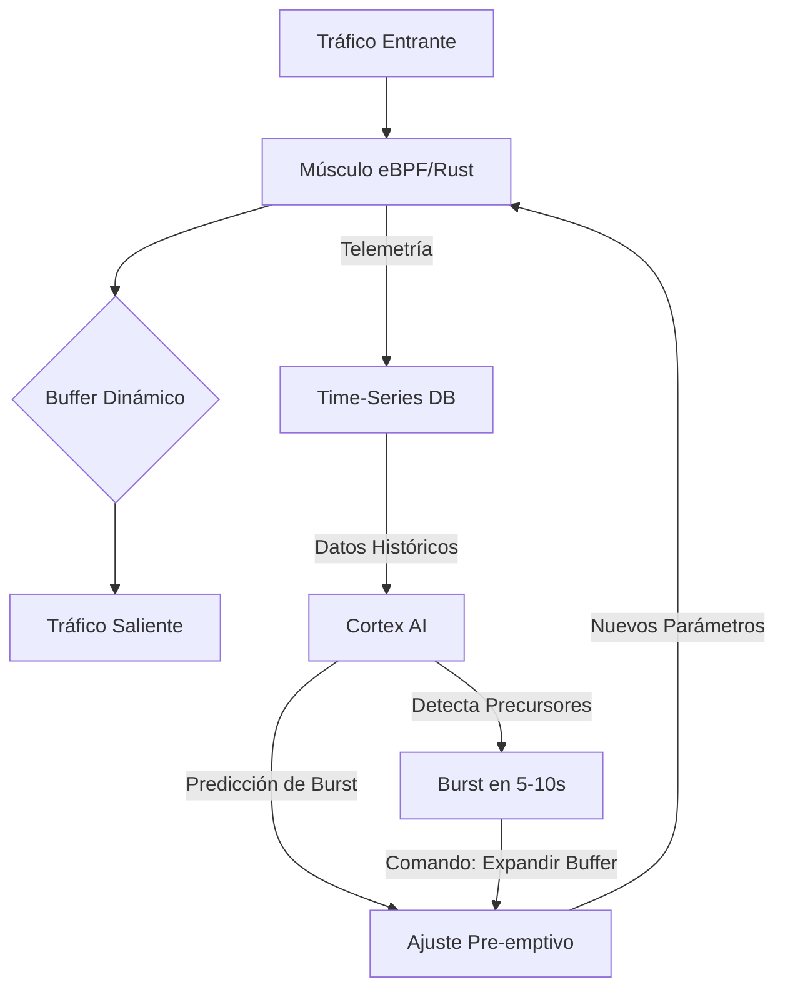

# Hybrid AI Control Architecture: Cortex + Músculo

## Visión General

**Sentinel Hybrid AI Control** fusiona la inteligencia predictiva de la IA (Cortex) con la ejecución determinística de control clásico (eBPF/Rust) para lograr "levitación" del tráfico: **cero packet drops, latencia constante, y preparación pre-emptiva ante ráfagas**.

### El Problema del Control Puro

| Enfoque | Ventajas | Desventajas |
|---------|----------|-------------|
| **PID/MPC Clásico** | Latencia ultra-baja (<1ms), determinístico | Miope, reactivo, no optimiza flujos complejos |
| **Reinforcement Learning Puro** | Aprende estrategias complejas | Jitter estocástico, latencia de inferencia (10-50ms), riesgo de "alucinaciones" |
| **Sentinel Híbrido** | Inteligencia predictiva + ejecución nanosegundo | Requiere sincronización precisa entre capas |

---

## Arquitectura de Dos Capas

### Capa 1: El Cerebro (Cortex AI) - Out-of-Loop

**Función**: Predicción, aprendizaje, optimización estratégica

**Tecnologías**:
- LSTM/Transformer para time-series forecasting
- KalmanFormer para estimación de estado oculto
- Modelos híbridos (LSTM + Prophet) para predicción de bursts

**Operación**:
- Analiza datos macro: tendencias de tráfico, patrones históricos, señales de precursores
- Predice eventos futuros con 5-10 segundos de anticipación
- Ajusta parámetros del controlador determinístico (Kp, Ki, Kd, buffer size, queue discipline)
- **NO está en el bucle crítico** → sin latencia de inferencia en el path de datos

**Output**: Comandos de configuración para el Músculo

---

### Capa 2: El Músculo (eBPF/Rust PID) - In-Loop

**Función**: Ejecución instantánea, control físico, reacción nanosegundo

**Tecnologías**:
- eBPF para control a nivel de kernel (XDP, TC)
- Rust para lógica de control de alta performance
- PID/MPC para estabilización de flujo

**Operación**:
- Ejecuta a "line-rate" (millones de ops/seg)
- Aplica los parámetros configurados por Cortex
- Reacciona a perturbaciones instantáneas (< 1µs)
- Ajusta buffers, queues, y prioridades en tiempo real
- **Está en el bucle crítico** → latencia de nanosegundos

**Input**: Configuración de Cortex + estado actual del sistema

---

## Flujo de Operación

### Ejemplo: Predicción de Burst

1. **t=0s**: Cortex detecta patrón de precursor (micro-incrementos en latencia, aumento gradual de conexiones)
2. **t=5s**: Cortex predice burst masivo con 95% de confianza para t=10s
3. **t=5.1s**: Cortex envía comando al Músculo: "Expandir buffer a 10MB, ajustar Kp=0.8"
4. **t=5.2s**: Músculo ejecuta el ajuste (< 1ms)
5. **t=10s**: Burst llega → buffer ya está expandido → **cero packet drops**

---

## Ventajas del Modelo Híbrido

### 1. Latencia Negativa
El sistema está preparado **antes** de que llegue la perturbación. El usuario experimenta una red que "anticipa" sus necesidades.

### 2. Estabilidad Garantizada
El Músculo (PID) garantiza estabilidad física del sistema, mientras Cortex optimiza para el futuro sin introducir jitter.

### 3. Escalabilidad Vertical
- **Músculo**: Escala de 1 buffer → 1000 buffers (cascada)
- **Cerebro**: Escala de 1 nodo → 1 ciudad → 1 planeta

### 4. Mantenimiento Cero
Cortex predice fallas de nodos y ejecuta failover pre-emptivo. El usuario nunca percibe una caída.

---

## Claim Patentable: Neural-Supervised Deterministic Control Loop

### Claim 8: Sistema de Control Híbrido con Supervisión Neural

**Título**: "Neural-Supervised Deterministic Control Loop for Network Traffic Optimization"

**Descripción**:
Un sistema de control de tráfico de red que comprende:
1. Una capa de control determinístico (eBPF/Rust PID) operando en el bucle crítico con latencia de nanosegundos
2. Una capa de supervisión neural (Cortex AI) operando fuera del bucle crítico, que:
   - Predice eventos futuros mediante modelos de time-series (LSTM/Transformer)
   - Ajusta dinámicamente los parámetros del controlador determinístico
   - Opera con latencia de segundos sin afectar el path de datos
3. Un protocolo de comunicación asíncrono entre capas que permite:
   - Actualización de parámetros sin interrumpir el flujo de datos
   - Predicción pre-emptiva de bursts con 5-10 segundos de anticipación
   - Expansión de buffers antes de la llegada del tráfico

**Ventaja sobre Prior Art**:
- **vs PID Clásico**: Agrega inteligencia predictiva sin sacrificar latencia
- **vs RL Puro**: Elimina jitter estocástico y garantiza estabilidad física
- **vs Hybrid Controllers existentes**: Opera con dos órdenes de magnitud menos latencia (nanosegundos vs milisegundos)

---

## Próximos Pasos

### Fase 1: Validación del Músculo
1. Implementar PID en eBPF/Rust
2. Benchmark de latencia (target: < 1µs)
3. Validar estabilidad bajo carga extrema

### Fase 2: Entrenamiento del Cerebro
1. Generar dataset de tráfico bursty
2. Entrenar modelo LSTM para predicción de bursts
3. Validar precisión de predicción (target: > 90%)

### Fase 3: Integración y Levitación
1. Conectar Cortex con Músculo
2. Ejecutar test de "Zero Drops"
3. Generar visualización de levitación

### Fase 4: Escalamiento Planetario
1. Extender de 1 buffer a cascada de buffers
2. Implementar FSU (Flow Stabilization Unit)
3. Proyección ultrasónica para control de ciudades

---

## Referencias Técnicas

- **PRL-PID**: Predictive Reinforcement Learning based PID (2025)
- **KalmanFormer**: Fusion of Kalman Filters with Transformers for State Estimation
- **Hybrid AI Control**: Combining Neural Networks with Classical Control Theory
- **eBPF Line-Rate Processing**: XDP/TC for nanosecond packet processing

---

**Conclusión**: Sentinel no reacciona, **predice**. El tráfico no choca con límites, **levita** sobre la infraestructura. 🚀
