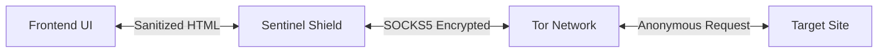

# 🧅 Secure Browser - Tor & "Shield" Architecture

**Prioridad**: Seguridad > Eficiencia.
**Objetivo**: Navegación anónima y transacciones seguras sin exponer la IP ni huella digital del usuario.

---

## 🛡️ Architecture: The "Tor Shield"

En lugar de un navegador convencional que corre en el cliente (exponiendo al usuario), utilizaremos una arquitectura de **Backend Proxy**.

### **1. Backend (The Shield)**
- **Role**: Intermediario de confianza.
- **Privacy**: Ejecuta las peticiones HTTP/HTTPS desde el servidor, no desde el cliente.
- **Tor Integration**: Enruta todo el tráfico a través de un proxy SOCKS5 (Tor) local.
- **Sanitization**: Limpia el HTML de trackers, ads y scripts maliciosos antes de enviarlo al frontend.

### **2. Frontend (The Viewer)**
- **Role**: Visualizador pasivo.
- **Isolation**: No ejecuta JavaScript del sitio web (opcional, configurable).
- **Zero-Leak**: Como el frontend solo habla con el Backend (localhost), nunca filtra la IP real del usuario a sitios externos.

---

## 🔒 Security Features

1.  **Tor Routing (Onion Routing)**:
    *   Triple encriptación.
    *   Anonimato de red completo.
    *   El sitio destino ve la IP de un nodo de salida de Tor, no la del usuario.

2.  **Fingerprint Protection**:
    *   User-Agent rotativo/genérico.
    *   Canvas fingerprinting bloqueado (al renderizar en frontend controlado).
    *   Headers HTTP normalizados.

3.  **Content Sanitization**:
    *   Eliminación de iframes, scripts de tracking, y pixeles ocultos.
    *   Conversión de contenido dinámico a estático seguro (Reader Mode por defecto).

---

## 🏗️ Implementation Strategy

### **Phase 5a: HTTP Proxy over Tor (Backend)**
Implementaremos un servicio en Python (`browser_service.py`) que:
1.  Recibe URL del frontend.
2.  Crea una sesión `requests` configurada con proxy SOCKS5 (`127.0.0.1:9050`).
3.  Hace la petición de forma anónima.
4.  Retorna el contenido purificado.

### **Phase 5b: Frontend UI**
1.  Barra de direcciones simple.
2.  Toggle "Tor Mode" (On/Off).
3.  Visor de HTML sanitizado (estilo "Reader View").

---

## ⚠️ Trade-offs

1.  **Velocidad**: Tor es intrínsecamente más lento (latencia alta).
    *   *Mitigación*: Caching agresivo y pre-fetching en backend.
2.  **Interactividad**: Sitios SPA (Single Page Apps) complejos pueden romperse si bloqueamos JS.
    *   *Solución*: Permitir JS selectivo o renderizar en backend (Headless Chrome) y enviar screenshots/stream (más complejo, fase futura).

---

## ✅ Conclusión

Esta arquitectura es la más **robusta para privacidad**. Al desacoplar el renderizado de la red, creamos un "air gap" virtual donde el usuario nunca toca directamente el sitio malicioso.

**Status**: Ready to implement Phase 5a.
