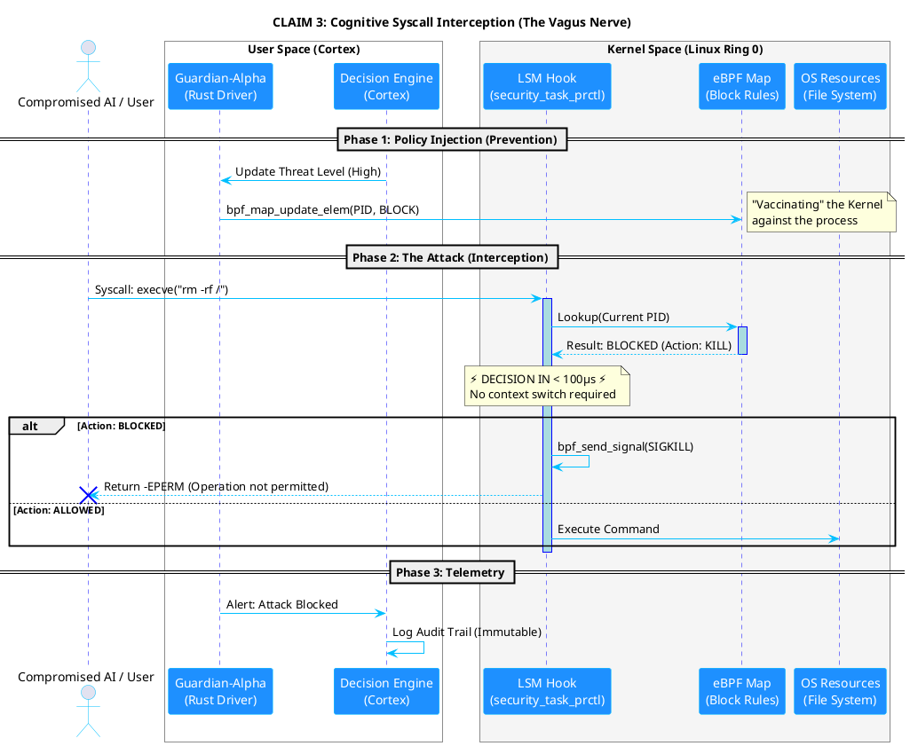
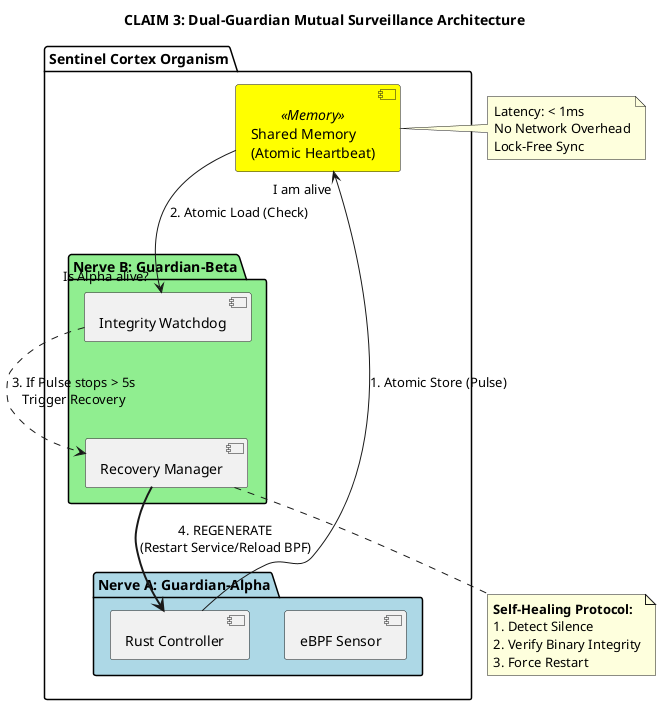

# 🎨 PLANTUML DIAGRAMS - PATENT FILING
**Sentinel Cortex™ - UML Diagrams for Provisional Patent**

**Fecha:** 17 Diciembre 2025 - 05:02 AM  
**Propósito:** Visual representation of Claims for patent filing  
**Status:** ✅ READY FOR RENDERING

---

## 📊 DIAGRAMA 1: THE VAGUS NERVE (eBPF ACTIVE DEFENSE)

### Propósito:
Visualiza **Claim 3** - Cómo el kernel rechaza físicamente la "alucinación" de la IA **ANTES** de que ocurra.

### Elementos Clave:
- ✅ **Pre-execution interception** (< 100μs)
- ✅ **LSM Hook** (security_task_prctl)
- ✅ **eBPF Map** (block rules)
- ✅ **SIGKILL** (process termination)
- ✅ **No context switch** (kernel-level decision)

### PlantUML Code:



### Diferenciación vs Prior Art:

| Feature | Sentinel (Claim 3) | Auditd (Prior Art) |
|---------|-------------------|-------------------|
| **Timing** | PRE-execution (< 100μs) | POST-execution (ms-seconds) |
| **Action** | BLOCK syscall (SIGKILL) | LOG event (alert) |
| **Location** | Kernel space (Ring 0) | User space (Ring 3) |
| **Result** | Data INTACT | Data LOST |
| **Race Condition** | ❌ Prevented | ✅ Vulnerable |

---

## 📊 DIAGRAMA 2: INMUNIDAD MUTUA (DUAL-GUARDIAN)

### Propósito:
Visualiza la **vigilancia asimétrica** y **auto-reparación**. Asuntos Internos + Médico.

### Elementos Clave:
- ✅ **Shared Memory** (atomic heartbeat)
- ✅ **Guardian-Alpha** (Nerve A - eBPF Sensor)
- ✅ **Guardian-Beta** (Nerve B - Integrity Watchdog)
- ✅ **Mutual Surveillance** (bi-directional monitoring)
- ✅ **Self-Healing Protocol** (auto-regeneration)

### PlantUML Code:



### Diferenciación vs Prior Art:

| Feature | Sentinel (Claim 3) | Kubernetes (Liveness Probe) | Systemd (Auto-Restart) |
|---------|-------------------|----------------------------|------------------------|
| **Surveillance** | Bi-directional (Alpha ↔ Beta) | Unidirectional (K8s → Pod) | Unidirectional (systemd → service) |
| **Heartbeat** | Atomic memory (< 1ms) | HTTP probe (10-30ms) | Exit code (immediate) |
| **Granularity** | Component-level | Pod-level | Service-level |
| **Recovery** | Policy restore + eBPF reload | Pod restart (no state) | Service restart (no state) |
| **Kernel Integration** | ✅ eBPF heartbeat | ❌ Container-only | ❌ Userspace |

---

## 📋 CÓMO GENERAR LOS DIAGRAMAS

### Opción 1: PlantUML Online (Rápido)
1. Ir a: https://www.plantuml.com/plantuml/uml/
2. Copiar el código PlantUML
3. Pegar en el editor
4. Click "Submit"
5. Descargar PNG/SVG

### Opción 2: PlantUML CLI (Local)
```bash
# Instalar PlantUML
sudo apt-get install plantuml  # Ubuntu/Debian
brew install plantuml          # macOS

# Generar diagrama
plantuml diagram1_vagus_nerve.puml
plantuml diagram2_dual_guardian.puml

# Output: diagram1_vagus_nerve.png, diagram2_dual_guardian.png
```

### Opción 3: VS Code Extension
1. Instalar extensión "PlantUML"
2. Abrir archivo .puml
3. Alt+D para preview
4. Export a PNG/SVG

---

## 📊 ARCHIVOS PARA PATENT FILING

### Crear estos archivos:

**1. diagram1_vagus_nerve.puml**
```
Copiar el código del Diagrama 1 (arriba)
```

**2. diagram2_dual_guardian.puml**
```
Copiar el código del Diagrama 2 (arriba)
```

**3. Generar imágenes:**
```bash
plantuml diagram1_vagus_nerve.puml
plantuml diagram2_dual_guardian.puml
```

**4. Incluir en patent application:**
- Figure 1: The Vagus Nerve (eBPF Active Defense)
- Figure 2: Dual-Guardian Mutual Surveillance

---

## 🎯 INTEGRACIÓN CON DOCUMENTACIÓN EXISTENTE

### Referencias en MASTER_SECURITY_IP_CONSOLIDATION.md:

**Sección 3.3 (Claim 3):**
> "Ver Figura 1 para ilustración del flujo de intercepción de syscalls mediante eBPF LSM hooks."

**Sección 3.3.3 (Realización Preferente):**
> "La arquitectura de vigilancia mutua se ilustra en Figura 2, mostrando el mecanismo de heartbeat atómico compartido entre Guardian-Alpha y Guardian-Beta."

### Referencias en UML_DIAGRAM_SPECIFICATIONS.md:

**Diagrama 1:**
> "Implementación PlantUML disponible en: docs/plantuml/diagram1_vagus_nerve.puml"

**Diagrama 2:**
> "Implementación PlantUML disponible en: docs/plantuml/diagram2_dual_guardian.puml"

---

## ✅ CHECKLIST DE COMPLETITUD

### Diagrama 1: The Vagus Nerve
- [x] Código PlantUML completo
- [x] 3 fases (Policy Injection, Attack, Telemetry)
- [x] Timing especificado (< 100μs)
- [x] LSM Hook + eBPF Map
- [x] SIGKILL + -EPERM
- [ ] Generar PNG/SVG (pendiente)
- [ ] Incluir en patent draft (pendiente)

### Diagrama 2: Dual-Guardian
- [x] Código PlantUML completo
- [x] Shared Memory (Atomic Heartbeat)
- [x] Guardian-Alpha + Guardian-Beta
- [x] Mutual surveillance flow
- [x] Self-healing protocol
- [ ] Generar PNG/SVG (pendiente)
- [ ] Incluir en patent draft (pendiente)

---

## 🎓 VALOR PARA PATENT FILING

### Por Qué Estos Diagramas Son Críticos:

1. **Visual Clarity:**
   - Patent examiners entienden mejor con diagramas
   - Reduce ambigüedad en claims
   - Facilita diferenciación vs prior art

2. **Enabling Description:**
   - Muestra implementación específica
   - Demuestra viabilidad técnica
   - Cumple requisito de "person skilled in the art can replicate"

3. **Claim Support:**
   - Diagrama 1 → Claim 3 (kernel-level interception)
   - Diagrama 2 → Claim 3 (mutual surveillance + auto-regeneration)

4. **Differentiation:**
   - Contraste visual vs Auditd (Diagrama 1)
   - Contraste vs Kubernetes/systemd (Diagrama 2)

---

## 📞 PRÓXIMOS PASOS

### Esta Semana:
1. **Generar PNG/SVG** de ambos diagramas
2. **Revisar con equipo técnico** (validar precisión)
3. **Enviar a patent attorney** junto con documentación

### Para Patent Attorney:
- Incluir como "Figure 1" y "Figure 2" en provisional patent
- Referenciar en secciones de Claims y Detailed Description
- Usar en presentaciones a examinadores si es necesario

---

**Documento:** PlantUML Diagrams - Patent Filing  
**Status:** ✅ CÓDIGO COMPLETO - LISTO PARA RENDERING  
**Figuras:** 2 (Vagus Nerve + Dual-Guardian)  
**Next Action:** Generar PNG/SVG e incluir en patent draft  
**Timeline:** Esta semana (antes de enviar a attorney)
