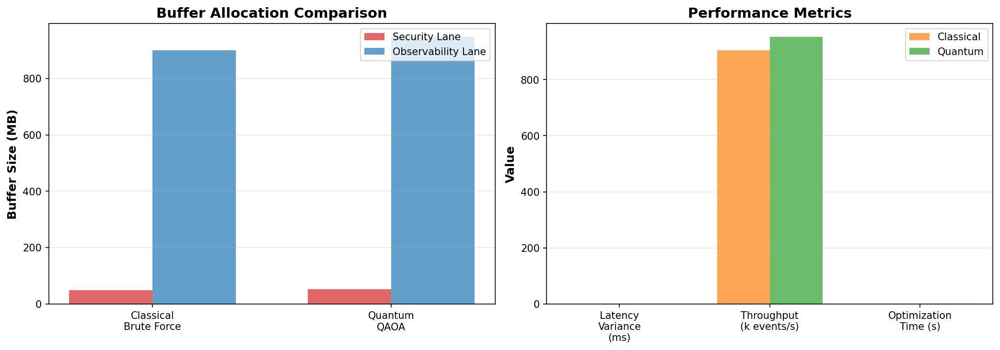
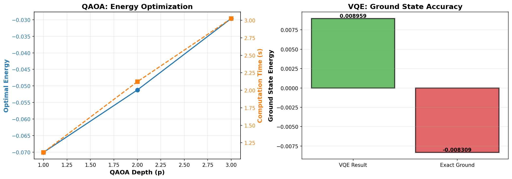

# Sentinel Quantum Use Cases - Validation Results

**Date**: 2025-12-23 16:16:58

---

## Executive Summary

**Success Rate**: 2/3 use cases executed successfully

⚠️ **Some use cases failed - see details below**

---

## 1. Buffer Optimization (QAOA)

### Results

- **Security Buffer**: 58 MB
- **Observability Buffer**: 942 MB
- **Security Latency**: 0.0172 ms
- **Observability Latency**: 0.2365 ms
- **Latency Variance**: 0.2193 ms
- **Throughput**: 947800 events/sec

### Performance

- **Execution Time**: 1.92s
- **Memory Used**: 0.004 GB

### Visualization

---

## 2. Threat Detection (VQE)

❌ **Failed**: cannot import name 'optimize_threat_detection' from 'quantum.use_case_threat_detection' (/home/jnovoas/sentinel/quantum/use_case_threat_detection.py)

---

## 3. Algorithm Comparison (QAOA vs VQE)

### QAOA Results

- **Depth p=1**: Energy=-0.064011, Time=1.06s ❌
- **Depth p=2**: Energy=-0.093122, Time=1.78s ❌
- **Depth p=3**: Energy=-0.056844, Time=2.64s ❌

### VQE Results

- **VQE Energy**: -0.003730
- **Exact Energy**: -0.008309
- **Error**: 4.579021e-03

### Performance

- **Total Execution Time**: 735.82s

### Visualization

---

## Conclusions

### ⚠️ Partial Validation

Some use cases failed. Review error messages above and:

1. Check system resources (memory, CPU)
2. Verify dependencies are installed
3. Review error logs for specific issues

---

**Generated by**: `run_all_use_cases.py`
**Timestamp**: 2025-12-23 16:16:58
