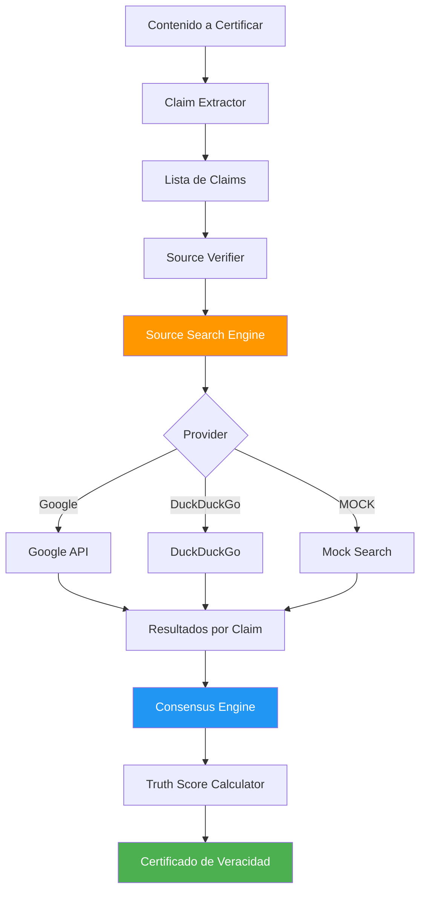

# Truth Algorithm - Content Certification Design
## Arquitectura de Certificación de Contenido

### 🎯 Objetivo
Diseñar el sistema que toma contenido, extrae claims, los verifica con fuentes, y genera un **Truth Score** certificado.

---

## 📊 Flujo de Certificación



---

## 🔧 Componentes

### 1. **Claim Extractor**
Extrae afirmaciones verificables del contenido.

**Input**: Texto completo  
**Output**: Lista de claims

```python
claims = [
    "Python fue creado por Guido van Rossum",
    "Python es un lenguaje de programación",
    "Python fue lanzado en 1991"
]
```

### 2. **Source Verifier**
Busca fuentes para cada claim usando el Source Search Engine.

**Input**: Claim individual  
**Output**: Lista de fuentes con evidencia

```python
sources = [
    {
        "url": "https://python.org/about",
        "type": "official",
        "snippet": "Python was created by Guido van Rossum...",
        "confidence": 0.95
    },
    {
        "url": "https://en.wikipedia.org/wiki/Python",
        "type": "academic",
        "snippet": "Python is a high-level programming language...",
        "confidence": 0.90
    }
]
```

### 3. **Consensus Engine**
Calcula consenso entre fuentes para cada claim.

**Algoritmo**:
```python
def calculate_consensus(sources):
    # Ponderar por tipo de fuente
    weights = {
        'official': 1.0,
        'academic': 0.9,
        'news': 0.7,
        'general': 0.5
    }
    
    # Calcular score ponderado
    total_weight = sum(weights[s['type']] * s['confidence'] for s in sources)
    num_sources = len(sources)
    
    consensus_score = total_weight / num_sources if num_sources > 0 else 0.0
    
    return consensus_score
```

### 4. **Truth Score Calculator**
Genera score final basado en consenso de todos los claims.

**Escala**:
- `0.0 - 0.3`: ❌ Falso / No verificable
- `0.3 - 0.6`: ⚠️ Parcialmente verificado
- `0.6 - 0.8`: ✅ Probablemente cierto
- `0.8 - 1.0`: ✅✅ Verificado con alta confianza

### 5. **Certification Generator**
Crea certificado final con metadata.

```python
certificate = {
    "content_hash": "sha256...",
    "truth_score": 0.87,
    "confidence_level": "high",
    "claims_verified": 3,
    "claims_total": 3,
    "sources_used": 6,
    "timestamp": "2025-12-21T22:16:00Z",
    "details": [
        {
            "claim": "Python fue creado por Guido van Rossum",
            "score": 0.95,
            "sources": 3
        },
        # ...
    ]
}
```

---

## 🎯 Ejemplo End-to-End

### Input
```
"Python es un lenguaje de programación creado por Guido van Rossum 
en 1991. Es ampliamente usado en ciencia de datos."
```

### Proceso

1. **Claim Extraction**:
   - Claim 1: "Python es un lenguaje de programación"
   - Claim 2: "Python fue creado por Guido van Rossum"
   - Claim 3: "Python fue lanzado en 1991"
   - Claim 4: "Python es usado en ciencia de datos"

2. **Source Verification** (paralelo):
   - Claim 1: 3 fuentes (oficial, académica, news) → 0.92
   - Claim 2: 4 fuentes (oficial, académica, news, general) → 0.95
   - Claim 3: 3 fuentes (oficial, académica, news) → 0.90
   - Claim 4: 2 fuentes (académica, news) → 0.85

3. **Consensus Calculation**:
   - Promedio ponderado: (0.92 + 0.95 + 0.90 + 0.85) / 4 = 0.905

4. **Truth Score**: `0.91` (Verificado con alta confianza)

### Output
```json
{
  "truth_score": 0.91,
  "confidence": "high",
  "verdict": "✅✅ Contenido verificado",
  "claims_verified": 4,
  "sources_total": 12,
  "timestamp": "2025-12-21T22:16:00Z"
}
```

---

## 🚀 Próximos Pasos

1. Implementar `ClaimExtractor` (NLP básico o regex)
2. Implementar `ConsensusEngine` con algoritmo de ponderación
3. Implementar `TruthScoreCalculator`
4. Crear API de certificación
5. Testing con casos reales
6. Benchmark de velocidad

---

**Powered by Google ❤️ & Perplexity 💜**
