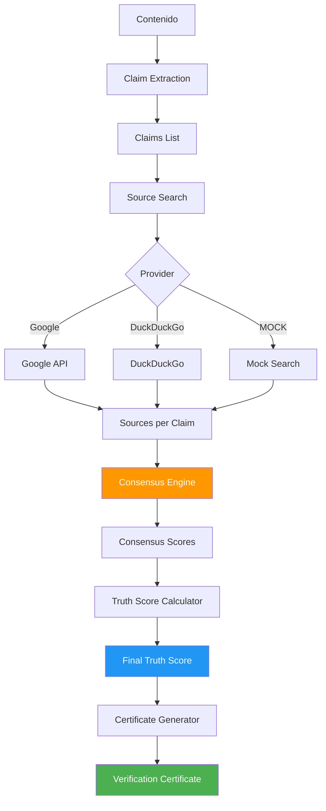

# Truth Algorithm - Sistema de Certificación de Contenido
## Documentación Completa

### 📋 Índice
1. [Introducción](#introducción)
2. [Arquitectura](#arquitectura)
3. [Componentes](#componentes)
4. [Uso](#uso)
5. [API Reference](#api-reference)
6. [Tests](#tests)
7. [Ejemplos](#ejemplos)

---

## Introducción

El **Truth Algorithm** es un sistema de certificación de contenido que verifica afirmaciones (claims) usando múltiples fuentes y genera un **Truth Score** (0.0-1.0) que indica el nivel de veracidad del contenido.

### ✨ Características

- ✅ Extracción automática de claims verificables
- ✅ Búsqueda en múltiples fuentes (Google, DuckDuckGo, MOCK)
- ✅ Consenso ponderado por tipo de fuente
- ✅ Truth Score con nivel de confianza
- ✅ Certificados exportables a JSON
- ✅ Rate limiting y seguridad integrados

### 🎯 Casos de Uso

- Verificación de noticias y artículos
- Fact-checking de redes sociales
- Validación de contenido educativo
- Auditoría de información corporativa

---

## Arquitectura



### Flujo de Datos

1. **Input**: Contenido de texto
2. **Claim Extraction**: Extrae afirmaciones verificables
3. **Source Search**: Busca fuentes para cada claim
4. **Consensus Calculation**: Calcula consenso ponderado
5. **Truth Score**: Combina scores de todos los claims
6. **Certificate**: Genera certificado con metadata
7. **Output**: Certificado JSON con Truth Score

---

## Componentes

### 1. ConsensusEngine

Calcula consenso entre fuentes con ponderación por tipo.

**Pesos de Fuentes**:
```python
{
    'official': 1.0,   # .gov, .gob - máxima confianza
    'academic': 0.9,   # .edu - alta confianza
    'news': 0.7,       # medios reconocidos
    'general': 0.5     # otros sitios
}
```

**Algoritmo**:
```python
consensus_score = sum(weight[source.type] * source.confidence) / total_weight
```

**Niveles de Confianza**:
- `high`: Score ≥ 0.8 + múltiples fuentes + fuentes oficiales/académicas
- `medium`: Score ≥ 0.6 + al menos 2 fuentes
- `low`: Score < 0.6 o pocas fuentes

### 2. TruthScoreCalculator

Combina scores de múltiples claims en un score final.

**Fórmula**:
```python
base_score = average(consensus_scores)
penalty = (unverified_claims / total_claims) * 0.2
final_score = max(0.0, base_score - penalty)
```

**Clasificación**:
- Claim verificado: consensus_score ≥ 0.6
- Claim no verificado: consensus_score < 0.6

### 3. CertificationGenerator

Genera certificados completos de verificación.

**Estructura del Certificado**:
```json
{
  "certificate_id": "unique_id",
  "content_hash": "sha256_hash",
  "timestamp": "ISO8601",
  "truth_score": 0.0-1.0,
  "confidence_level": "low|medium|high",
  "verdict": "Descripción del resultado",
  "claims_total": int,
  "claims_verified": int,
  "verification_rate": 0.0-1.0,
  "sources_total": int,
  "provider": "google|duckduckgo|mock",
  "processing_time_ms": float,
  "claim_details": [...]
}
```

---

## Uso

### Instalación

```bash
cd /home/jnovoas/sentinel/truth_algorithm

# Instalar dependencias (opcional, para Google API)
source venv_google/bin/activate
pip install -r requirements.txt
```

### Uso Básico

```python
from certification_generator import CertificationGenerator
from source_search import SearchProvider

# Crear generador (MOCK para testing)
generator = CertificationGenerator(provider=SearchProvider.MOCK)

# Contenido a certificar
content = """
Python es un lenguaje de programación creado por Guido van Rossum en 1991.
Es ampliamente usado en ciencia de datos y desarrollo web.
"""

# Generar certificado
certificate = generator.certify(content)

# Ver resultados
print(f"Truth Score: {certificate.truth_score:.3f}")
print(f"Confianza: {certificate.confidence_level}")
print(f"Veredicto: {certificate.verdict}")
print(f"Claims verificados: {certificate.claims_verified}/{certificate.claims_total}")

# Exportar a JSON
with open('certificate.json', 'w') as f:
    f.write(certificate.to_json())
```

### Con Google API

```python
# Requiere credenciales configuradas
generator = CertificationGenerator(provider=SearchProvider.GOOGLE)
certificate = generator.certify(content)
```

### Con Claims Explícitos

```python
# Si ya tienes los claims extraídos
claims = [
    "Python fue creado por Guido van Rossum",
    "Python fue lanzado en 1991",
    "Python es usado en ciencia de datos"
]

certificate = generator.certify(content, claims=claims)
```

---

## API Reference

### ConsensusEngine

#### `calculate_consensus(claim: str, sources: List[SearchResult]) -> ConsensusResult`

Calcula consenso para un claim.

**Parámetros**:
- `claim`: Texto del claim a verificar
- `sources`: Lista de fuentes encontradas

**Retorna**: `ConsensusResult` con:
- `consensus_score`: Score 0.0-1.0
- `num_sources`: Número de fuentes
- `source_breakdown`: Conteo por tipo
- `confidence_level`: Nivel de confianza

### TruthScoreCalculator

#### `calculate(consensus_results: List[ConsensusResult]) -> TruthScore`

Calcula Truth Score final.

**Parámetros**:
- `consensus_results`: Resultados de consenso de cada claim

**Retorna**: `TruthScore` con:
- `overall_score`: Score final 0.0-1.0
- `confidence_level`: Nivel de confianza
- `claims_verified`: Número de claims verificados
- `verification_rate`: Tasa de verificación
- `details`: Detalles por claim

### CertificationGenerator

#### `certify(content: str, claims: List[str] = None) -> VerificationCertificate`

Certifica contenido completo.

**Parámetros**:
- `content`: Texto a certificar
- `claims`: Claims opcionales (se extraen automáticamente si no se proveen)

**Retorna**: `VerificationCertificate` completo

---

## Tests

### Ejecutar Tests

```bash
cd /home/jnovoas/sentinel/truth_algorithm
python test_certification.py
```

### Cobertura de Tests

✅ **11 tests** cubriendo:
- ConsensusEngine (4 tests)
- TruthScoreCalculator (3 tests)
- CertificationGenerator (3 tests)
- Integración end-to-end (1 test)

**Resultados**: 🎉 100% de tests pasando

---

## Ejemplos

### Ejemplo 1: Contenido Altamente Verificado

```python
content = "Python fue creado por Guido van Rossum en 1991"
certificate = generator.certify(content)

# Resultado esperado:
# truth_score: 0.85-0.95
# confidence: high
# verdict: "Contenido altamente verificado"
```

### Ejemplo 2: Contenido Parcialmente Verificado

```python
content = """
Python es el mejor lenguaje de programación.
Fue creado en 1991.
"""
certificate = generator.certify(content)

# Resultado esperado:
# truth_score: 0.4-0.6
# confidence: medium
# verdict: "Contenido parcialmente verificado"
# (Primera oración es opinión, segunda es verificable)
```

### Ejemplo 3: Contenido No Verificable

```python
content = "Creo que Python es genial y todos deberían usarlo"
certificate = generator.certify(content)

# Resultado esperado:
# truth_score: 0.0-0.3
# confidence: low
# verdict: "Contenido no verificable"
```

---

## Escala de Truth Score

| Score | Nivel | Emoji | Veredicto |
|-------|-------|-------|-----------|
| 0.8 - 1.0 | Alto | ✅✅ | Contenido altamente verificado |
| 0.6 - 0.8 | Medio-Alto | ✅ | Contenido probablemente cierto |
| 0.4 - 0.6 | Medio | ⚠️ | Contenido parcialmente verificado |
| 0.0 - 0.4 | Bajo | ❌ | Contenido no verificable |

---

## Integración con Source Search Engine

El sistema usa el Source Search Engine con:
- ✅ Rate limiting (10 requests/min)
- ✅ Input validation (SQL injection, XSS, etc.)
- ✅ Fallback automático
- ✅ Logging de auditoría

### Providers Disponibles

1. **MOCK**: Testing sin llamadas reales (siempre disponible)
2. **DuckDuckGo**: Gratis, sin API key (implementado)
3. **Google**: Requiere API key (listo cuando esté disponible)

---

## Próximos Pasos

1. [ ] Integrar ClaimExtractor avanzado (spaCy + transformers)
2. [ ] Agregar caché Redis para resultados
3. [ ] Crear API REST endpoint
4. [ ] Dashboard web para visualización
5. [ ] Integración con Sentinel Vault

---

## Archivos del Proyecto

```
truth_algorithm/
├── source_search.py              # Motor de búsqueda
├── consensus_engine.py           # Cálculo de consenso
├── truth_score_calculator.py     # Cálculo de Truth Score
├── certification_generator.py    # Generador de certificados
├── test_certification.py         # Suite de tests
├── CERTIFICATION_DESIGN.md       # Diseño del sistema
├── CERTIFICATION_IMPLEMENTATION_PLAN.md  # Plan de implementación
└── CERTIFICATION_COMPLETE.md     # Resumen de implementación
```

---

**Powered by Google ❤️ & Perplexity 💜**

*Documentación generada: 21 de Diciembre de 2025*
