# 📐 TruthSync - UML Diagrams & Visual Architecture

**Purpose**: Professional diagrams for stakeholder communication and technical understanding

---

## 🎯 DIAGRAM INDEX

1. [System Architecture Diagram](#1-system-architecture)
2. [Component Diagram](#2-component-diagram)
3. [Sequence Diagram - Happy Path](#3-sequence-diagram-happy-path)
4. [Sequence Diagram - Cache Hit](#4-sequence-diagram-cache-hit)
5. [Class Diagram - Core Components](#5-class-diagram)
6. [Deployment Diagram](#6-deployment-diagram)
7. [Data Flow Diagram](#7-data-flow-diagram)

---

## 1. SYSTEM ARCHITECTURE

---

## 2. COMPONENT DIAGRAM

---

## 3. SEQUENCE DIAGRAM - HAPPY PATH

---

## 4. SEQUENCE DIAGRAM - CACHE HIT

```mermaid
sequenceDiagram
    participant Client
    participant API
    participant Engine as TruthSync Engine
    participant Buffer as Sub-Buffer
    participant Cache as Predictive Cache
    participant Metrics as Prometheus
    
    Client->>API: POST /verify {"text": "..."}
    API->>Engine: process(text)
    
    Engine->>Buffer: write_input(text)
    Buffer->>Cache: check(hash(text))
    
    Note over Cache: Cache HIT!<br/>Return immediately
    Cache-->>Buffer: claims (cached)
    
    Buffer->>Engine: return cached_claims
    
    Note over Engine: Skip Rust processing<br/>~1μs total latency
    
    Engine->>Metrics: record_cache_hit()
    Engine->>API: return {claims, confidence}
    API->>Client: 200 OK {claims: [...]}
    
    Note over Client,Metrics: Total time: ~5μs<br/>(vs ~20μs for full processing)
```

---

## 5. CLASS DIAGRAM

---

## 6. DEPLOYMENT DIAGRAM

---

## 7. DATA FLOW DIAGRAM

---

## 📊 PERFORMANCE VISUALIZATION

---

## 🎓 EXPLANATION FOR STAKEHOLDERS

### Why This Architecture Works

**1. Hybrid Design**
- Python handles high-level logic (easy to modify)
- Rust handles heavy computation (10-500x faster)
- Best of both worlds

**2. Zero-Copy Buffers**
- Shared memory = no data copying
- ~2μs overhead (negligible)
- Enables true parallelism

**3. Predictive Caching**
- AI predicts which content needs processing
- 80%+ cache hit rate expected
- 5x speedup from caching alone

**4. Self-Verification**
- System validates its own predictions
- Adapts thresholds automatically
- Improves over time

**5. Sentinel Integration**
- Feeds existing ML pipeline
- Leverages proven infrastructure
- No new systems needed

### Key Metrics

| Metric | Value | Meaning |
|--------|-------|---------|
| Cache Hit Rate | 80%+ | Most requests served instantly |
| Processing Time | <20μs | 50x faster than Python |
| Accuracy | >85% | High-quality predictions |
| Throughput | 500k/sec | Handles massive scale |

---

**These diagrams can be imported into:**
- Draw.io / Lucidchart (Mermaid export)
- PlantUML (convert syntax)
- Microsoft Visio (import Mermaid)
- Confluence / Notion (native Mermaid support)
